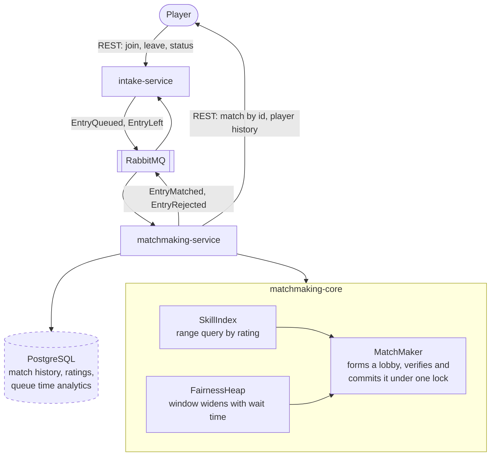

<a id="readme-top"></a>

[![Contributors][contributors-shield]][contributors-url]
[![Forks][forks-shield]][forks-url]
[![Stargazers][stars-shield]][stars-url]
[![Issues][issues-shield]][issues-url]
[![CI][ci-shield]][ci-url]
[![MIT License][license-shield]][license-url]

<br />
<div align="center">
  <h3 align="center">Match3D</h3>

  <p align="center">
    Match3D is a concurrent, skill based matchmaking engine that decides how much match quality is worth trading for a shorter queue. Split across two services that share nothing but a message queue.
    <br />
    <a href="docs/project-extended-description.md"><strong>How it works, in detail</strong></a>
    &middot;
    <a href="docs/design-choices.md">Design choices</a>
    &middot;
    <a href="https://github.com/Amrovv/match3d/issues">Report a bug</a>
  </p>
</div>

<details>
  <summary>Contents</summary>
  <ol>
    <li><a href="#about-the-project">About the project</a>
      <ul>
        <li><a href="#project-status">Project status</a></li>
        <li><a href="#documentation">Documentation</a></li>
        <li><a href="#built-with">Built with</a></li>
      </ul>
    </li>
    <li><a href="#architecture">Architecture</a></li>
    <li><a href="#getting-started">Getting started</a></li>
    <li><a href="#deployment">Deployment</a></li>
    <li><a href="#roadmap">Roadmap</a></li>
    <li><a href="#limitations">Limitations</a></li>
    <li><a href="#contributing">Contributing</a></li>
    <li><a href="#license">License</a></li>
    <li><a href="#contact">Contact</a></li>
    <li><a href="#acknowledgments">Acknowledgments</a></li>
  </ol>
</details>

## About the project

Match3D accepts players into a skill based queue, alone or in parties of up to five, and matches them into balanced lobbies of two teams of five. A party always plays together, on one team. The queue itself is not the point of focus, what the queue has to reconcile is. A player wants a lobby full of players at a similar rating to their own, but at the same time they want reasonable queue times. Those two aspects pull against one another, and the engine must decide and optimise how much match quality to trade for how much waiting.

The engine is a standalone module with no web framework and no network code, so it can be exercised and reasoned about on its own. Two services sit around it, coordinating only over a message queue.

### Project status

The core engine is built and tested: the skill index, the fairness heap and its widening window, the matching pass, the concurrency work that lets several threads run it against one shared queue, and parties queued as a single entry and seated on one team, covered by 207 tests and a benchmark. It runs behind two services: `intake-service` takes players in over REST, `matchmaking-service` runs the engine, and the two talk only over RabbitMQ, with 51 more tests between them. Nothing is persisted or containerised yet, so every service keeps its state in memory. See the <a href="#roadmap">roadmap</a> for what is done and what is not.

<p align="right">(<a href="#readme-top">back to top</a>)</p>

### Documentation

Two longer documents sit in `docs/`, and this README is the summary of both.

| Document | Holds |
|---|---|
| [Extended description](docs/project-extended-description.md) | How each part of the system actually works, in the order it was built, including the API surface and the cost of every operation. |
| [Design choices](docs/design-choices.md) | Every major design decision taken, explaining the choice, the trade offs, and the alternatives considered. |

<p align="right">(<a href="#readme-top">back to top</a>)</p>

### Built with

* [![Java][java-shield]][java-url]
* [![Gradle][gradle-shield]][gradle-url]
* [![JUnit5][junit-shield]][junit-url]
* [![Spring Boot][spring-shield]][spring-url]
* [![RabbitMQ][rabbitmq-shield]][rabbitmq-url]
* [![GitHub Actions][actions-shield]][actions-url]

Planned, not yet in the build: PostgreSQL, Docker, Kubernetes, AWS.

<p align="right">(<a href="#readme-top">back to top</a>)</p>

## Architecture



Dashed means not built yet.

| Module | Holds | Status |
|---|---|---|
| `matchmaking-core` | Domain model, parties, skill index, fairness heap, widening function, matching algorithm, concurrency | Built |
| `common` | The four events both services exchange, and their JSON mapping | Built |
| `intake-service` | REST endpoints to join alone or as a party, leave, and read status | Built |
| `matchmaking-service` | Consumes joins and leaves, runs the engine, reports lobbies, serves match history | Built, in memory until PostgreSQL |

`matchmaking-core` deliberately has no framework dependency. It is testable without starting a service, and matching decisions are made there rather than scattered across the two services, which is what makes this one system rather than two services stapled together.

<p align="right">(<a href="#readme-top">back to top</a>)</p>

## Getting started

### Prerequisites

* JDK 21. The Gradle toolchain is pinned to 21, so another JDK on the path is fine as long as 21 is resolvable.
* No local Gradle install needed, the wrapper is committed.
* Docker, to run RabbitMQ locally.

### Installation

```sh
git clone https://github.com/Amrovv/match3d.git
cd match3d
./gradlew build
```

### Usage

Start RabbitMQ, then each service in its own terminal:

```sh
docker run -d --name match3d-rabbit -p 5672:5672 -p 15672:15672 rabbitmq:4-management
./gradlew :intake-service:bootRun
./gradlew :matchmaking-service:bootRun
```

Intake listens on 8080 and matchmaking on 8081. The RabbitMQ dashboard is at localhost:15672, as `guest`.

| Endpoint | Does |
|---|---|
| `POST :8080/queue/join` | Queues one to five player ids as a solo or a party, `{"memberIds": [...]}`. Returns the entry id. |
| `POST :8080/queue/leave` | Leaves by entry id, `{"entryId": "..."}`. |
| `GET :8080/queue/status/{playerId}` | Queued, matched with both teams, refused with the reason, or not queued. |
| `GET :8081/matches/{id}` | A formed match, both teams by player id. |
| `GET :8081/players/{id}/history` | Every match a player was in, newest first. |

Ten players at the same rating form a lobby as soon as the tenth joins. Every player not yet seen starts at a rating of 2500.

Each module's tests run on their own:

```sh
./gradlew :matchmaking-core:test
./gradlew :intake-service:test
./gradlew :matchmaking-service:test
```

Throughput under contention is measured separately, and is excluded from the normal build because a timing measurement is not a regression gate:

```sh
./gradlew :matchmaking-core:benchmark
```

The HTML report lands in `matchmaking-core/build/reports/tests/test/index.html`.

<p align="right">(<a href="#readme-top">back to top</a>)</p>

## Deployment

Not yet implemented.

<p align="right">(<a href="#readme-top">back to top</a>)</p>

## Roadmap

- [x] Milestone 0, repo, CI, and the branch to pull request workflow
- [x] Milestone 1, core engine, skill index, fairness heap, and matching algorithm
- [x] Milestone 2, concurrency, the race reproduced and fixed
- [x] Milestone 3, parties, queued as one entry and always seated on one team of five
- [x] Milestone 4, split into two services over RabbitMQ, REST API
- [ ] Milestone 5, PostgreSQL persistence and Elo style rating updates
- [ ] Milestone 6, Docker images and Compose for local development
- [ ] Milestone 7, Kubernetes manifests, proven against minikube
- [ ] Milestone 8, deployment to AWS, k3s on EC2 with RDS, and the delivery step in CI

<p align="right">(<a href="#readme-top">back to top</a>)</p>

## Limitations

* Matching is greedy. It can miss a valid lobby that exists elsewhere in the queue.
* A lobby forms only when its entries fill two teams of exactly five, and a party is never split. Once solos run out, parties whose sizes cannot combine into fives wait until someone smaller joins. In a closed benchmark queue of 20k people, nine in ten of them in parties, 2000 were never matched.
* A lobby is lost if matchmaking cannot publish it, because the broker is down or the process dies after the engine commits. Intake then holds those ten players as queued and refuses their rejoins until it restarts. A durable outbox comes with PostgreSQL.
* Intake's records are in memory while the queue is durable. Joins left in the queue across an intake restart are matched as players intake no longer knows, alongside real ones.
* A matched player reads as matched until they queue again, since nothing yet reports that a game ended.
* Ratings, match history and intake's status boards are in memory and only grow.
* A message a service cannot handle is logged and dropped. There is no dead letter queue to keep it for inspection.
* Joining a party while already queued is refused rather than moving the player into it.
* Every commit serialises through one lock, so the engine scales by making passes cheap rather than by running more of them. Sharding the queue by rating band is the recorded next step.
* Matching runs in one process. Several threads share one engine, but nothing coordinates two engines, so scaling out is a design question rather than a configuration one.
* The benchmark measures throughput on a synthetic population. No latency or queue time figure is measured, and the widening curve's constants have no data behind them.

<p align="right">(<a href="#readme-top">back to top</a>)</p>

## Contributing

Solo project, run on a professional workflow: feature branches, Conventional Commits, pull requests, and CI on GitHub.

<p align="right">(<a href="#readme-top">back to top</a>)</p>

## License

Distributed under the MIT License. See [`LICENSE.txt`](LICENSE.txt) for more information.

<p align="right">(<a href="#readme-top">back to top</a>)</p>

## Contact

Adam Wasiak, adamwasiak55@gmail.com

Project link: [https://github.com/Amrovv/match3d](https://github.com/Amrovv/match3d)

<p align="right">(<a href="#readme-top">back to top</a>)</p>

## Acknowledgments

* [Best README Template](https://github.com/othneildrew/Best-README-Template), which this README is structured from.
* [The art of writing meaningful Git commit messages](https://thoughtbot.com/blog/5-useful-tips-for-a-better-commit-message), thoughtbot, which the commit style follows.

<p align="right">(<a href="#readme-top">back to top</a>)</p>

[contributors-shield]: https://img.shields.io/github/contributors/Amrovv/match3d.svg?style=for-the-badge
[contributors-url]: https://github.com/Amrovv/match3d/graphs/contributors
[forks-shield]: https://img.shields.io/github/forks/Amrovv/match3d.svg?style=for-the-badge
[forks-url]: https://github.com/Amrovv/match3d/network/members
[stars-shield]: https://img.shields.io/github/stars/Amrovv/match3d.svg?style=for-the-badge
[stars-url]: https://github.com/Amrovv/match3d/stargazers
[issues-shield]: https://img.shields.io/github/issues/Amrovv/match3d.svg?style=for-the-badge
[issues-url]: https://github.com/Amrovv/match3d/issues
[license-shield]: https://img.shields.io/github/license/Amrovv/match3d.svg?style=for-the-badge
[license-url]: https://github.com/Amrovv/match3d/blob/main/LICENSE.txt
[ci-shield]: https://img.shields.io/github/actions/workflow/status/Amrovv/match3d/ci.yml?style=for-the-badge&label=CI
[ci-url]: https://github.com/Amrovv/match3d/actions/workflows/ci.yml
[java-shield]: https://img.shields.io/badge/Java%2021-ED8B00?style=for-the-badge&logo=openjdk&logoColor=white
[java-url]: https://openjdk.org/projects/jdk/21/
[gradle-shield]: https://img.shields.io/badge/Gradle-02303A?style=for-the-badge&logo=gradle&logoColor=white
[gradle-url]: https://gradle.org/
[junit-shield]: https://img.shields.io/badge/JUnit5-25A162?style=for-the-badge&logo=junit5&logoColor=white
[junit-url]: https://junit.org/junit5/
[spring-shield]: https://img.shields.io/badge/Spring%20Boot-6DB33F?style=for-the-badge&logo=springboot&logoColor=white
[spring-url]: https://spring.io/projects/spring-boot
[rabbitmq-shield]: https://img.shields.io/badge/RabbitMQ-FF6600?style=for-the-badge&logo=rabbitmq&logoColor=white
[rabbitmq-url]: https://www.rabbitmq.com/
[actions-shield]: https://img.shields.io/badge/GitHub%20Actions-2088FF?style=for-the-badge&logo=githubactions&logoColor=white
[actions-url]: https://github.com/features/actions
