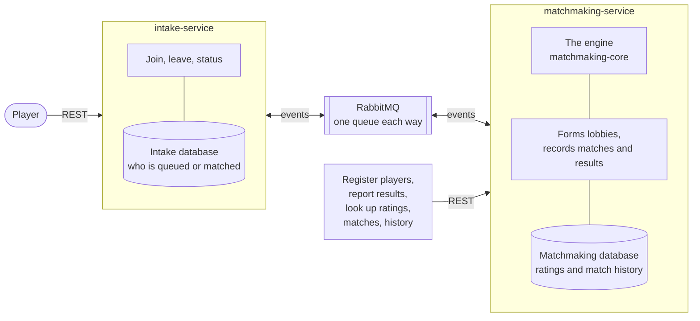

<a id="readme-top"></a>

[![Contributors][contributors-shield]][contributors-url]
[![Forks][forks-shield]][forks-url]
[![Stargazers][stars-shield]][stars-url]
[![Issues][issues-shield]][issues-url]
[![CI][ci-shield]][ci-url]
[![MIT License][license-shield]][license-url]

<br />
<div align="center">
  <h3 align="center">Match3D</h3>

  <p align="center">
    Match3D is a concurrent, skill based matchmaking engine that decides how much match quality is worth trading for a shorter queue. Split across two services that share nothing but a message queue.
    <br />
    <a href="docs/project-extended-description.md"><strong>How it works, in detail</strong></a>
    &middot;
    <a href="docs/design-choices.md">Design choices</a>
    &middot;
    <a href="https://github.com/Amrovv/match3d/issues">Report a bug</a>
  </p>
</div>

<details>
  <summary>Contents</summary>
  <ol>
    <li><a href="#about-the-project">About the project</a>
      <ul>
        <li><a href="#project-status">Project status</a></li>
        <li><a href="#documentation">Documentation</a></li>
        <li><a href="#built-with">Built with</a></li>
      </ul>
    </li>
    <li><a href="#architecture">Architecture</a></li>
    <li><a href="#getting-started">Getting started</a></li>
    <li><a href="#deployment">Deployment</a></li>
    <li><a href="#roadmap">Roadmap</a></li>
    <li><a href="#limitations">Limitations</a></li>
    <li><a href="#contributing">Contributing</a></li>
    <li><a href="#license">License</a></li>
    <li><a href="#contact">Contact</a></li>
    <li><a href="#acknowledgments">Acknowledgments</a></li>
  </ol>
</details>

## About the project

Match3D accepts players into a skill based queue, alone or in parties of up to five, and matches them into balanced lobbies of two teams of five. A party always plays together, on one team. The queue itself is not the point of focus, what the queue has to reconcile is. A player wants a lobby full of players at a similar rating to their own, but at the same time they want reasonable queue times. Those two aspects pull against one another, and the engine must decide and optimise how much match quality to trade for how much waiting.

The engine is a standalone module with no web framework and no network code, so it can be exercised and reasoned about on its own. Two services sit around it, coordinating only over a message queue.

### Project status

The core engine is built and tested: the skill index, the fairness heap and its widening window, the matching pass, the concurrency work that lets several threads run it against one shared queue, and parties queued as a single entry and placed on one team, covered by 207 tests and a benchmark. It runs behind two services: `intake-service` takes players in over REST, `matchmaking-service` runs the engine, and the two talk only over RabbitMQ. Each service keeps its state in a PostgreSQL database of its own, so intake can run as several copies, and either service can restart without stranding a player: a restarted matchmaking has intake send every queued entry again, lost joins are found and sent again, and a heartbeat tells queued players when matchmaking is down, alongside an estimate of their wait. Match results move ratings. The services add 120 tests, run against a real PostgreSQL. Each service builds into a Docker image, one `docker compose up` runs the whole system, an end to end test checks it from outside, and every merge to `main` publishes both images to the GitHub Container Registry. Kubernetes and a cloud deployment are not built yet. See the <a href="#roadmap">roadmap</a> for what is done and what is not.

<p align="right">(<a href="#readme-top">back to top</a>)</p>

### Documentation

Two longer documents sit in `docs/`, and this README is the summary of both.

| Document | Holds |
|---|---|
| [Extended description](docs/project-extended-description.md) | How each part of the system actually works, in the order it was built, including the API surface and the cost of every operation. |
| [Design choices](docs/design-choices.md) | Every major design decision taken, explaining the choice, the trade offs, and the alternatives considered. |

<p align="right">(<a href="#readme-top">back to top</a>)</p>

### Built with

* [![Java][java-shield]][java-url]
* [![Gradle][gradle-shield]][gradle-url]
* [![JUnit5][junit-shield]][junit-url]
* [![Spring Boot][spring-shield]][spring-url]
* [![RabbitMQ][rabbitmq-shield]][rabbitmq-url]
* [![PostgreSQL][postgres-shield]][postgres-url]
* [![Flyway][flyway-shield]][flyway-url]
* [![Testcontainers][testcontainers-shield]][testcontainers-url]
* [![Docker][docker-shield]][docker-url]
* [![GitHub Actions][actions-shield]][actions-url]

Planned, not yet in the build: Kubernetes, AWS.

<p align="right">(<a href="#readme-top">back to top</a>)</p>

## Architecture



Players queue, leave and check their status through intake. Registering players, reporting results, and looking up a rating, a match or a player's history go to matchmaking directly. Intake and matchmaking never call each other: every join, leave, match and heartbeat travels as an event on RabbitMQ, and each service owns its database, which the other never reads.

| Direction | Events |
|---|---|
| intake to matchmaking | a player or party joined, an entry left |
| matchmaking to intake | an entry was accepted or refused, a lobby formed, a match ended, matchmaking restarted, and a heartbeat every ten seconds |

The full list of events and what each carries is in the [extended description](docs/project-extended-description.md#the-events).

| Module | Holds | Status |
|---|---|---|
| `matchmaking-core` | Domain model, parties, skill index, fairness heap, widening function, matching algorithm, concurrency | Built |
| `common` | The eight events both services exchange, and their JSON mapping | Built |
| `intake-service` | REST endpoints to join alone or as a party, leave, and read status, over its own database; the sweeper for unconfirmed entries | Built |
| `matchmaking-service` | Consumes joins and leaves, runs the engine, records matches and ratings, takes results, sends the heartbeat | Built |
| `e2e-tests` | Checks the running system from outside, over HTTP only, including that its data survives a restart | Built |

`matchmaking-core` deliberately has no framework dependency. It is testable without starting a service, and matching decisions are made there rather than scattered across the two services, which is what makes this one system rather than two services stapled together.

<p align="right">(<a href="#readme-top">back to top</a>)</p>

## Getting started

### Prerequisites

* Docker, with Compose. That is all running the system needs.
* JDK 21, to build and test outside Docker and to run the end to end check. No local Gradle install is needed, the wrapper is committed.

### Installation

```sh
git clone https://github.com/Amrovv/match3d.git
cd match3d
docker compose up --build
```

That builds both service images and starts them with PostgreSQL and RabbitMQ. Intake listens on localhost:8080 and matchmaking on localhost:8081. The RabbitMQ dashboard is at localhost:15672, as `guest`. `docker compose down` stops everything and keeps the data; `docker compose down -v` wipes it.

### Usage

The database starts empty, so register players first, then queue them. Ten players at the same rating form a lobby as soon as the tenth joins. A player who was never registered is refused as unknown.

```sh
curl -X POST localhost:8081/players -H 'Content-Type: application/json' -d '{"id": "00000000-0000-0000-0000-000000000001"}'
curl -X POST localhost:8080/queue/join -H 'Content-Type: application/json' -d '{"memberIds": ["00000000-0000-0000-0000-000000000001"]}'
curl localhost:8080/queue/status/00000000-0000-0000-0000-000000000001
```

| Endpoint | Does |
|---|---|
| `POST :8080/queue/join` | Queues one to five player ids as a solo or a party, `{"memberIds": [...]}`. Returns the entry id. |
| `POST :8080/queue/leave` | Leaves by entry id, `{"entryId": "..."}`. |
| `GET :8080/queue/status/{playerId}` | Queued with whether matchmaking is up and the estimated wait, matched with both teams, refused with the reason, or not queued. |
| `POST :8081/players` | Registers a player at 2500 under the caller's id, `{"id": "..."}`. |
| `GET :8081/players/{id}` | A player's current rating. |
| `GET :8081/matches/{id}` | A formed match, both teams by player id. |
| `GET :8081/players/{id}/history` | Every match a player was in, newest first. |
| `POST :8081/matches/{id}/result` | Records the winner, `{"winner": "A"}`, or tosses a coin with no body. Winners gain 100, losers lose 100. |

The end to end check starts the stack, registers and queues ten players, reports a result, restarts the services and the database, and checks nothing was lost:

```sh
bash scripts/e2e-compose.sh
```

To run the services outside containers instead, with PostgreSQL and RabbitMQ on their usual ports, and each service in its own terminal:

```sh
docker run -d --name match3d-rabbit -p 5672:5672 -p 15672:15672 rabbitmq:4-management
docker run -d --name match3d-postgres -p 5432:5432 -e POSTGRES_PASSWORD=match3d -v match3d-pgdata:/var/lib/postgresql/data postgres:17
docker exec match3d-postgres createdb -U postgres matchmaking
docker exec match3d-postgres createdb -U postgres intake
./gradlew :intake-service:bootRun
./gradlew :matchmaking-service:bootRun --args='--spring.profiles.active=local'
```

The `local` profile loads twenty players at 2500, with ids `00000000-0000-0000-0000-000000000001` to `...020`, so a lobby can be formed straight away.

Each module's tests run on their own. The service tests need Docker running, and start a throwaway PostgreSQL of their own:

```sh
./gradlew :matchmaking-core:test
./gradlew :intake-service:test
./gradlew :matchmaking-service:test
```

Throughput under contention is measured separately, and is excluded from the normal build because a timing measurement is not a regression gate:

```sh
./gradlew :matchmaking-core:benchmark
```

The HTML report lands in `matchmaking-core/build/reports/tests/test/index.html`.

<p align="right">(<a href="#readme-top">back to top</a>)</p>

## Deployment

Every merge to `main`, once all tests pass, publishes both images to the GitHub Container Registry, tagged with the commit SHA and `latest`:

```sh
docker pull ghcr.io/amrovv/match3d-intake:latest
docker pull ghcr.io/amrovv/match3d-matchmaking:latest
```

The system currently runs in Docker Compose on one machine. Kubernetes, first on minikube and then on AWS, is not built yet.

<p align="right">(<a href="#readme-top">back to top</a>)</p>

## Roadmap

- [x] Milestone 0, repo, CI, and the branch to pull request workflow
- [x] Milestone 1, core engine, skill index, fairness heap, and matching algorithm
- [x] Milestone 2, concurrency, the race reproduced and fixed
- [x] Milestone 3, parties, queued as one entry and always placed on one team of five
- [x] Milestone 4, split into two services over RabbitMQ, REST API
- [x] Milestone 5, PostgreSQL persistence, rating updates from results, and recovery from either service restarting
- [x] Milestone 6, Docker images, Compose, an end to end check, and images published from CI
- [ ] Milestone 7, Kubernetes manifests, proven against minikube
- [ ] Milestone 8, deployment to AWS, k3s on EC2 with RDS, and the delivery step in CI

<p align="right">(<a href="#readme-top">back to top</a>)</p>

## Limitations

The ones that matter most. The [full list](docs/project-extended-description.md#limitations) is in the extended description.

* **Matching is greedy.** It can miss a valid lobby elsewhere in the queue, and parties whose sizes cannot make two teams of five can wait until someone smaller joins.
* **One engine, one lock.** Matching runs in one process and every lobby commits under one lock. Intake scales out; matchmaking does not yet.
* **Ratings are simple.** A result moves every player by a flat 100, whoever they played.
* **Rare crashes leave loose ends.** A crash at the wrong moment can leave a match that is never resulted, or a player shown as matched after their match ended.
* **Tuning is not measured.** How fast the rating window widens is chosen, not derived from real players, and only throughput is benchmarked.
* **Not deployed yet.** The system runs in Docker Compose on one machine, with a password kept in the repository. Kubernetes and AWS come next.

<p align="right">(<a href="#readme-top">back to top</a>)</p>

## Contributing

Solo project, run on a professional workflow: feature branches, Conventional Commits, pull requests, and CI on GitHub.

<p align="right">(<a href="#readme-top">back to top</a>)</p>

## License

Distributed under the MIT License. See [`LICENSE.txt`](LICENSE.txt) for more information.

<p align="right">(<a href="#readme-top">back to top</a>)</p>

## Contact

Adam Wasiak, adamwasiak55@gmail.com

Project link: [https://github.com/Amrovv/match3d](https://github.com/Amrovv/match3d)

<p align="right">(<a href="#readme-top">back to top</a>)</p>

## Acknowledgments

* [Best README Template](https://github.com/othneildrew/Best-README-Template), which this README is structured from.
* [The art of writing meaningful Git commit messages](https://thoughtbot.com/blog/5-useful-tips-for-a-better-commit-message), thoughtbot, which the commit style follows.

<p align="right">(<a href="#readme-top">back to top</a>)</p>

[contributors-shield]: https://img.shields.io/github/contributors/Amrovv/match3d.svg?style=for-the-badge
[contributors-url]: https://github.com/Amrovv/match3d/graphs/contributors
[forks-shield]: https://img.shields.io/github/forks/Amrovv/match3d.svg?style=for-the-badge
[forks-url]: https://github.com/Amrovv/match3d/network/members
[stars-shield]: https://img.shields.io/github/stars/Amrovv/match3d.svg?style=for-the-badge
[stars-url]: https://github.com/Amrovv/match3d/stargazers
[issues-shield]: https://img.shields.io/github/issues/Amrovv/match3d.svg?style=for-the-badge
[issues-url]: https://github.com/Amrovv/match3d/issues
[license-shield]: https://img.shields.io/github/license/Amrovv/match3d.svg?style=for-the-badge
[license-url]: https://github.com/Amrovv/match3d/blob/main/LICENSE.txt
[ci-shield]: https://img.shields.io/github/actions/workflow/status/Amrovv/match3d/ci.yml?style=for-the-badge&label=CI
[ci-url]: https://github.com/Amrovv/match3d/actions/workflows/ci.yml
[java-shield]: https://img.shields.io/badge/Java%2021-ED8B00?style=for-the-badge&logo=openjdk&logoColor=white
[java-url]: https://openjdk.org/projects/jdk/21/
[gradle-shield]: https://img.shields.io/badge/Gradle-02303A?style=for-the-badge&logo=gradle&logoColor=white
[gradle-url]: https://gradle.org/
[junit-shield]: https://img.shields.io/badge/JUnit5-25A162?style=for-the-badge&logo=junit5&logoColor=white
[junit-url]: https://junit.org/junit5/
[spring-shield]: https://img.shields.io/badge/Spring%20Boot-6DB33F?style=for-the-badge&logo=springboot&logoColor=white
[spring-url]: https://spring.io/projects/spring-boot
[rabbitmq-shield]: https://img.shields.io/badge/RabbitMQ-FF6600?style=for-the-badge&logo=rabbitmq&logoColor=white
[rabbitmq-url]: https://www.rabbitmq.com/
[postgres-shield]: https://img.shields.io/badge/PostgreSQL-4169E1?style=for-the-badge&logo=postgresql&logoColor=white
[postgres-url]: https://www.postgresql.org/
[flyway-shield]: https://img.shields.io/badge/Flyway-CC0200?style=for-the-badge&logo=flyway&logoColor=white
[flyway-url]: https://flywaydb.org/
[testcontainers-shield]: https://img.shields.io/badge/Testcontainers-291A3F?style=for-the-badge&logo=testcontainers&logoColor=white
[testcontainers-url]: https://testcontainers.com/
[docker-shield]: https://img.shields.io/badge/Docker-2496ED?style=for-the-badge&logo=docker&logoColor=white
[docker-url]: https://www.docker.com/
[actions-shield]: https://img.shields.io/badge/GitHub%20Actions-2088FF?style=for-the-badge&logo=githubactions&logoColor=white
[actions-url]: https://github.com/features/actions
