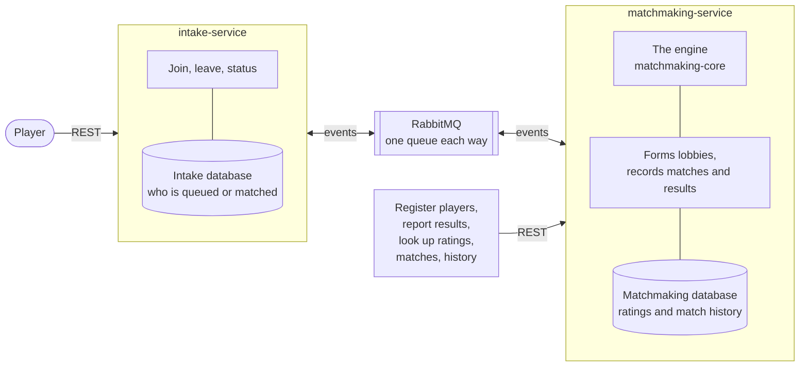

<a id="readme-top"></a>

[![Contributors][contributors-shield]][contributors-url]
[![Forks][forks-shield]][forks-url]
[![Stargazers][stars-shield]][stars-url]
[![Issues][issues-shield]][issues-url]
[![CI][ci-shield]][ci-url]
[![MIT License][license-shield]][license-url]

<br />
<div align="center">
  <h3 align="center">Match3D</h3>

  <p align="center">
    Match3D is a concurrent, skill based matchmaking engine that decides how much match quality is worth trading for a shorter queue. It runs as a distributed system: two services that share nothing but a message queue, with the player facing side running as parallel copies across servers, packaged with Docker and orchestrated by Kubernetes.
    <br />
    <a href="docs/project-extended-description.md"><strong>How it works, in detail</strong></a>
    &middot;
    <a href="docs/design-choices.md">Design choices</a>
    &middot;
    <a href="https://github.com/Amrovv/match3d/issues">Report a bug</a>
  </p>
</div>

<details>
  <summary>Contents</summary>
  <ol>
    <li><a href="#about-the-project">About the project</a>
      <ul>
        <li><a href="#documentation">Documentation</a></li>
        <li><a href="#built-with">Built with</a></li>
      </ul>
    </li>
    <li><a href="#architecture">Architecture</a></li>
    <li><a href="#getting-started">Getting started</a></li>
    <li><a href="#deployment">Deployment</a></li>
    <li><a href="#future-work">Future work</a></li>
    <li><a href="#limitations">Limitations</a></li>
    <li><a href="#contributing">Contributing</a></li>
    <li><a href="#license">License</a></li>
    <li><a href="#contact">Contact</a></li>
    <li><a href="#acknowledgments">Acknowledgments</a></li>
  </ol>
</details>

## About the project

Matchmaking is split into two halves: parallel intake across servers, and one engine that decides how much match quality each second of waiting is worth, with nothing shared between them but a message queue. It balances the two things every player wants, a fast game and a fair one: each player's acceptable rating range starts narrow and widens the longer they wait, so solos and parties of up to five are formed into balanced teams of five without anyone waiting forever.

The engine is a standalone module with no web framework and no network code, so it can be exercised and reasoned about on its own. Around it sits a distributed system built to survive failure. Players arrive through `intake-service`, which runs as several interchangeable copies spread across servers, so any copy can crash without losing a single player. The engine runs in `matchmaking-service`, and the two coordinate only over RabbitMQ, so either can restart without losing anyone in the queue. Each service is a Docker image, and Kubernetes runs them across a simulated three server cluster, where losing a copy under load has been tested to cost no player.

<p align="right">(<a href="#readme-top">back to top</a>)</p>

### Documentation

This README is the summary. The detail sits in `docs/`.

| Document | Holds |
|---|---|
| [Extended description](docs/project-extended-description.md) | How each part of the system actually works, from the cluster down to the engine, including the API surface and the cost of every operation. |
| [Design choices](docs/design-choices.md) | Every major design decision taken, explaining the choice, the trade offs, and the alternatives considered. |
| [Running the system](docs/running-the-system.md) | Starting it with Compose or on Kubernetes, the full API, and running the tests and the benchmark. |

<p align="right">(<a href="#readme-top">back to top</a>)</p>

### Built with

* [![Java][java-shield]][java-url]
* [![Gradle][gradle-shield]][gradle-url]
* [![JUnit5][junit-shield]][junit-url]
* [![Spring Boot][spring-shield]][spring-url]
* [![RabbitMQ][rabbitmq-shield]][rabbitmq-url]
* [![PostgreSQL][postgres-shield]][postgres-url]
* [![Flyway][flyway-shield]][flyway-url]
* [![Testcontainers][testcontainers-shield]][testcontainers-url]
* [![Docker][docker-shield]][docker-url]
* [![Kubernetes][kubernetes-shield]][kubernetes-url]
* [![GitHub Actions][actions-shield]][actions-url]

<p align="right">(<a href="#readme-top">back to top</a>)</p>

## Architecture


```mermaid
flowchart LR
    player(["Player"])

    subgraph intake["intake-service"]
        direction TB
        intakeapi["Join, leave, status"]
        intakedb[("Intake database<br/>who is queued or matched")]
        intakeapi --- intakedb
    end

    rabbit[["RabbitMQ<br/>one queue each way"]]

    subgraph matchmaking["matchmaking-service"]
        direction TB
        engine["The engine<br/>matchmaking#8209;core"]
        runner["Forms lobbies,<br/>records matches and results"]
        mmdb[("Matchmaking database<br/>ratings and match history")]
        engine --- runner --- mmdb
    end

    clients["Register players,<br/>report results,<br/>look up ratings,<br/>matches, history"]

    player -->|REST| intake
    intake <-->|events| rabbit
    rabbit <-->|events| matchmaking
    clients -->|REST| matchmaking
```

Players queue, leave and check their status through intake. Registering players, reporting results, and looking up a rating, a match or a player's history go to matchmaking directly. Intake and matchmaking never call each other: every join, leave, match and heartbeat travels as an event on RabbitMQ, and each service owns its database, which the other never reads.

**Why it is split this way.** The two halves have opposite needs. Intake takes every player's requests and must never go down, so it keeps nothing in memory and runs as many copies. The engine must see the whole queue at once to match fairly, so it runs as one process. The queue between them lets either restart without the other losing anything. More in the [extended description](docs/project-extended-description.md#two-services-over-a-queue).

| Direction | Events |
|---|---|
| intake to matchmaking | a player or party joined, an entry left |
| matchmaking to intake | an entry was accepted or refused, a lobby formed, a match ended, matchmaking restarted, and a heartbeat every ten seconds |

The full list of events and what each carries is in the [extended description](docs/project-extended-description.md#the-events).

| Module | Holds |
|---|---|
| `matchmaking-core` | Domain model, parties, skill index, fairness heap, widening function, matching algorithm, concurrency |
| `common` | The eight events both services exchange, and their JSON mapping |
| `intake-service` | REST endpoints to join alone or as a party, leave, and read status, over its own database; the sweeper for unconfirmed entries |
| `matchmaking-service` | Consumes joins and leaves, runs the engine, records matches and ratings, takes results, sends the heartbeat |
| `e2e-tests` | Checks the running system from outside, over HTTP only, under Compose or on Kubernetes: its data surviving a restart, intake as several copies, and a copy killed under load |

`matchmaking-core` deliberately has no framework dependency. It is testable without starting a service, and matching decisions are made there rather than scattered across the two services, which is what makes this one system rather than two services stapled together.

<p align="right">(<a href="#readme-top">back to top</a>)</p>

## Getting started

Docker with Compose is all running the system needs. JDK 21 is needed to run the tests and the end to end checks; the Gradle wrapper is committed.

```sh
git clone https://github.com/Amrovv/match3d.git
cd match3d
docker compose up --build
```

That starts both services with PostgreSQL and RabbitMQ: intake on localhost:8080, matchmaking on localhost:8081. The database starts empty, so register a player, then queue them:

```sh
curl -X POST localhost:8081/players -H 'Content-Type: application/json' -d '{"id": "00000000-0000-0000-0000-000000000001"}'
curl -X POST localhost:8080/queue/join -H 'Content-Type: application/json' -d '{"memberIds": ["00000000-0000-0000-0000-000000000001"]}'
curl localhost:8080/queue/status/00000000-0000-0000-0000-000000000001
```

Ten players queued at the same rating form a lobby as soon as the tenth joins. `bash scripts/e2e-compose.sh` runs a full lobby from outside, then restarts everything and checks nothing was lost.

The full API, running on Kubernetes, running without containers, and the tests and benchmark are all in [running the system](docs/running-the-system.md).

<p align="right">(<a href="#readme-top">back to top</a>)</p>

## Deployment

Every merge to `main`, once all tests pass, publishes both images to the GitHub Container Registry as `ghcr.io/amrovv/match3d-intake` and `ghcr.io/amrovv/match3d-matchmaking`, tagged with the commit SHA and `latest`.

### Kubernetes

Intake is the front door, so one copy of it would be a single point of failure and a ceiling on how many players the system can take in. It runs as several interchangeable copies instead, which only works because it keeps no state in memory. The system is built to run across many machines, so Kubernetes is used to simulate a multi server deployment locally: minikube runs a three node cluster on one machine, each node standing in for a server, and the design's distributed claims are tested against it. Kubernetes keeps the system in shape as it runs: it replaces a copy that dies, sends players only to copies that can reach their database and RabbitMQ, and never runs two matchmaking engines at once. The same manifests in `k8s/` would run on a cloud cluster, with only addresses, the password and image names changed.

| | intake | matchmaking |
|---|---|---|
| Copies | Three, one per server | One |
| Why | It keeps no state in memory, so any copy serves any player | The engine's queue is one process's memory, and two engines would split it |
| Replaced | One copy at a time, never fewer than three | Stopped first, so two engines never run at once |
| Health | Gets players only while its database and RabbitMQ answer | The same |

Tested against the running cluster:

* **Every copy serves.** At three, two and one copies, players pass through all of them with none lost or queued twice, even when one player joins through every copy at once.
* **A killed copy costs nobody.** An intake copy deleted while players are joining loses no player, and the cluster replaces it by itself.
* **Nothing is lost on restart.** Both services, PostgreSQL and RabbitMQ restarted, every player, match and rating still there.

The cluster shares one machine, so a node stands in for a server rather than being one, and it is brought up by hand rather than deployed from CI. How it works is in the [extended description](docs/project-extended-description.md#running-on-kubernetes), why each choice was made is in [design choices](docs/design-choices.md#running-on-kubernetes), and how to run it is in [running the system](docs/running-the-system.md#running-it-on-kubernetes).

<p align="right">(<a href="#readme-top">back to top</a>)</p>

## Future work

The system is complete as it stands. These are the natural next steps.

* **A cloud deployment.** The same manifests on a small cluster in the cloud, such as k3s on one server, with a managed PostgreSQL, and a step in CI that deploys each merged build. Only addresses, the Secret and image names would change.
* **Matchmaking across several processes.** Splitting the queue by rating band, one engine per band, so matchmaking scales out the way intake already does.
* **Ratings that weigh the opponent.** An Elo style update in place of the flat 100.
* **Keeping failed messages.** A dead letter queue, so a message a service cannot handle is kept for inspection rather than dropped.

<p align="right">(<a href="#readme-top">back to top</a>)</p>

## Limitations

The ones that matter most. The [full list](docs/project-extended-description.md#limitations) is in the extended description.

* **Matching is greedy.** It can miss a valid lobby elsewhere in the queue, and parties whose sizes cannot make two teams of five can wait until someone smaller joins.
* **One engine, one lock.** Matching runs in one process and every lobby commits under one lock. Intake scales out; matchmaking does not yet.
* **Ratings are simple.** A result moves every player by a flat 100, whoever they played.
* **Rare crashes leave loose ends.** A crash at the wrong moment can leave a match that is never resulted, or a player shown as matched after their match ended.
* **Tuning is not measured.** How fast the rating window widens is chosen, not derived from real players, and only throughput is benchmarked.
* **One machine.** The Kubernetes cluster is minikube, three nodes on one machine, with PostgreSQL and RabbitMQ outside it as single instances. It shows orchestration, not a production deployment, and nothing deploys automatically.

<p align="right">(<a href="#readme-top">back to top</a>)</p>

## Contributing

Solo project, run on a professional workflow: feature branches, Conventional Commits, pull requests, and CI on GitHub.

<p align="right">(<a href="#readme-top">back to top</a>)</p>

## License

Distributed under the MIT License. See [`LICENSE.txt`](LICENSE.txt) for more information.

<p align="right">(<a href="#readme-top">back to top</a>)</p>

## Contact

Adam Wasiak, adamwasiak55@gmail.com

Project link: [https://github.com/Amrovv/match3d](https://github.com/Amrovv/match3d)

<p align="right">(<a href="#readme-top">back to top</a>)</p>

## Acknowledgments

* [Best README Template](https://github.com/othneildrew/Best-README-Template), which this README is structured from.
* [The art of writing meaningful Git commit messages](https://thoughtbot.com/blog/5-useful-tips-for-a-better-commit-message), thoughtbot, which the commit style follows.

<p align="right">(<a href="#readme-top">back to top</a>)</p>

[contributors-shield]: https://img.shields.io/github/contributors/Amrovv/match3d.svg?style=for-the-badge
[contributors-url]: https://github.com/Amrovv/match3d/graphs/contributors
[forks-shield]: https://img.shields.io/github/forks/Amrovv/match3d.svg?style=for-the-badge
[forks-url]: https://github.com/Amrovv/match3d/network/members
[stars-shield]: https://img.shields.io/github/stars/Amrovv/match3d.svg?style=for-the-badge
[stars-url]: https://github.com/Amrovv/match3d/stargazers
[issues-shield]: https://img.shields.io/github/issues/Amrovv/match3d.svg?style=for-the-badge
[issues-url]: https://github.com/Amrovv/match3d/issues
[license-shield]: https://img.shields.io/github/license/Amrovv/match3d.svg?style=for-the-badge
[license-url]: https://github.com/Amrovv/match3d/blob/main/LICENSE.txt
[ci-shield]: https://img.shields.io/github/actions/workflow/status/Amrovv/match3d/ci.yml?style=for-the-badge&label=CI
[ci-url]: https://github.com/Amrovv/match3d/actions/workflows/ci.yml
[java-shield]: https://img.shields.io/badge/Java%2021-ED8B00?style=for-the-badge&logo=openjdk&logoColor=white
[java-url]: https://openjdk.org/projects/jdk/21/
[gradle-shield]: https://img.shields.io/badge/Gradle-02303A?style=for-the-badge&logo=gradle&logoColor=white
[gradle-url]: https://gradle.org/
[junit-shield]: https://img.shields.io/badge/JUnit5-25A162?style=for-the-badge&logo=junit5&logoColor=white
[junit-url]: https://junit.org/junit5/
[spring-shield]: https://img.shields.io/badge/Spring%20Boot-6DB33F?style=for-the-badge&logo=springboot&logoColor=white
[spring-url]: https://spring.io/projects/spring-boot
[rabbitmq-shield]: https://img.shields.io/badge/RabbitMQ-FF6600?style=for-the-badge&logo=rabbitmq&logoColor=white
[rabbitmq-url]: https://www.rabbitmq.com/
[postgres-shield]: https://img.shields.io/badge/PostgreSQL-4169E1?style=for-the-badge&logo=postgresql&logoColor=white
[postgres-url]: https://www.postgresql.org/
[flyway-shield]: https://img.shields.io/badge/Flyway-CC0200?style=for-the-badge&logo=flyway&logoColor=white
[flyway-url]: https://flywaydb.org/
[testcontainers-shield]: https://img.shields.io/badge/Testcontainers-291A3F?style=for-the-badge&logo=testcontainers&logoColor=white
[testcontainers-url]: https://testcontainers.com/
[docker-shield]: https://img.shields.io/badge/Docker-2496ED?style=for-the-badge&logo=docker&logoColor=white
[docker-url]: https://www.docker.com/
[kubernetes-shield]: https://img.shields.io/badge/Kubernetes-326CE5?style=for-the-badge&logo=kubernetes&logoColor=white
[kubernetes-url]: https://kubernetes.io/
[actions-shield]: https://img.shields.io/badge/GitHub%20Actions-2088FF?style=for-the-badge&logo=githubactions&logoColor=white
[actions-url]: https://github.com/features/actions
