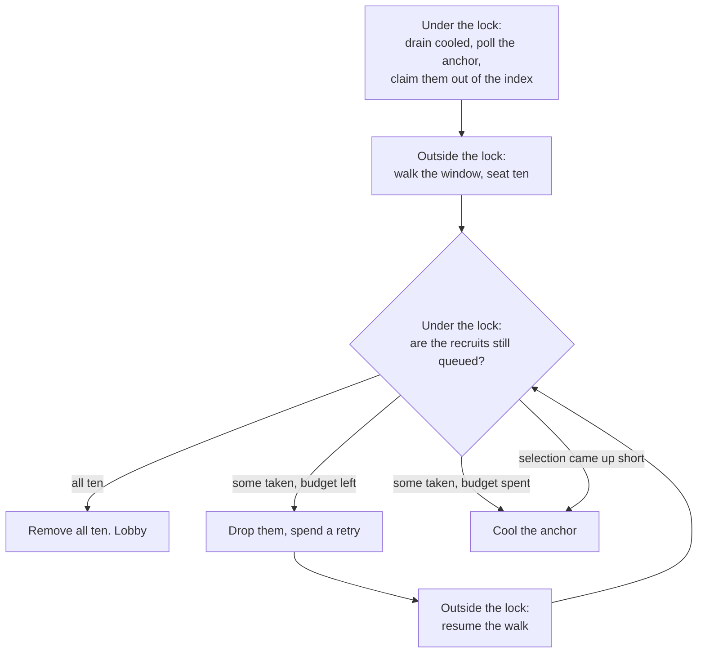
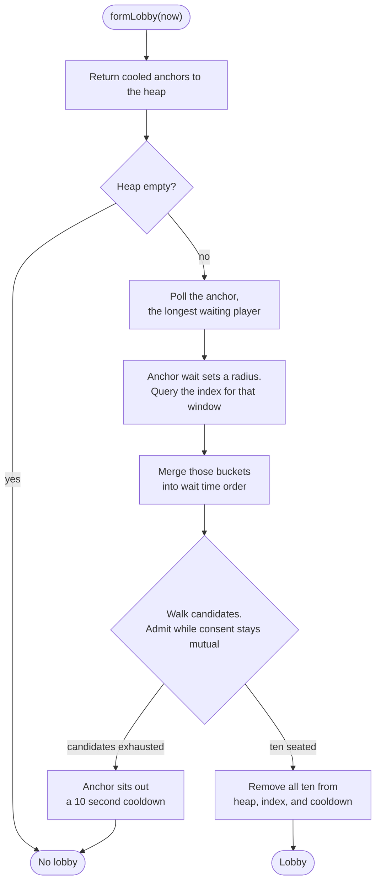
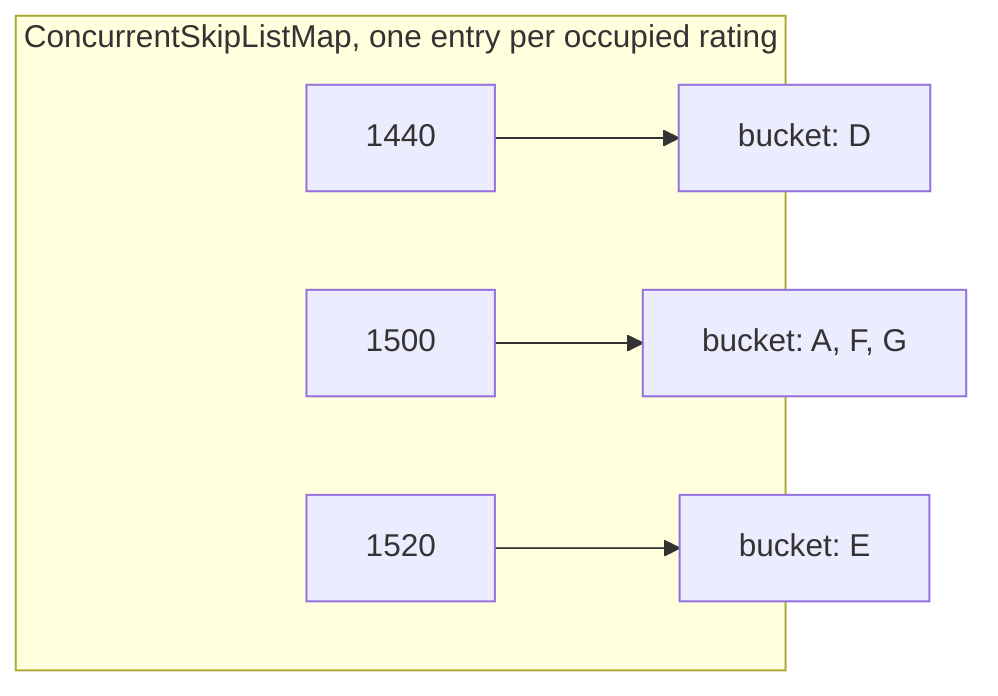
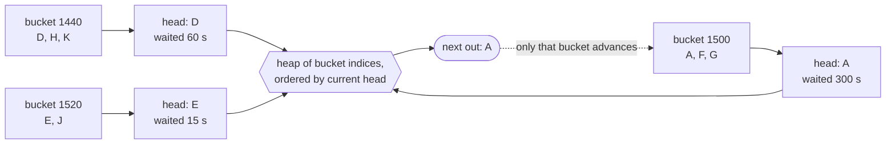

# Extended description

How each part of the system works, close enough to follow without opening a file.

Only built work appears here. New sections go at the top as they land, so the most recent work is the first thing read. Why a decision was taken rather than what it does is in [design-choices.md](design-choices.md).

## Contents

1. [Parties and teams](#parties-and-teams)
2. [Matching under contention](#matching-under-contention)
3. [Forming a lobby](#forming-a-lobby)
4. [The consent check](#the-consent-check)
5. [The skill index](#the-skill-index)
6. [Fairness and the widening window](#fairness-and-the-widening-window)
7. [Drawing candidates in wait time order](#drawing-candidates-in-wait-time-order)
8. [The domain model](#the-domain-model)
9. [Cost of each operation](#cost-of-each-operation)
10. [Verification](#verification)
11. [The build and the pipeline](#the-build-and-the-pipeline)

## Parties and teams

Friends can queue together as a party of two to five. A party always lands in the same lobby, on the same team, or not at all. A lobby is two teams of five.

### Why parties are harder than solos

Not because there is more work. A party is one entry, so every draw, consent check, verify and removal touches it once, the same as a solo, and lobbies form faster with parties than without. Parties add two problems that solo matching never has.

**Filling becomes fitting.** With solos, any ten players who all consent make a lobby. With parties, entries have sizes and cannot be split, so the job is packing them into two teams of exactly five. Three parties of three and a solo all consent and fill ten seats, and still make no lobby, since nothing adds up to five. A walk that seats greedily and never backtracks can also get stuck at nine with one seat only a solo can take, and a queue left holding only threes and fours never forms a lobby at all.

**A group needs one rating.** The index, the heap and the consent check all work on one number, so a party has to be squashed into one, and every choice is wrong for someone. The plain mean of a 1000 and a 3500 is 2250, so the 3500 plays opponents far below them and the 1000 plays opponents far above. The highest member instead punishes every ordinary party that happens to have one stronger friend. The mean is shifted halfway toward the strongest, putting that pair at 2875 while an ordinary party barely moves. Whatever the choice, the engine now sees one derived number, so the rule capping the gap between members has to be checked where parties are formed and trusted after.

### A party is one queue entry

The queue does not hold people, it holds entries. `QueueEntry` is a sealed interface with two implementations: `Player`, one person, and `Party`, several people who queued together. Every entry has one id, one rating, one queue time, a size and a list of members.

| | `Player` | `Party` |
|---|---|---|
| id | the player's | a fresh random one per party |
| rating | the player's | derived from the members, below |
| queue time | when they joined | when the party joined, shared by all |
| size | 1 | 2 to 5 |
| members | themselves | the people in it |

Because a party has one rating and one queue time, the index files it in one bucket, the heap orders it in one position, and the consent check tests it as one rating with one radius. None of the three know parties exist. The matcher does not branch on which kind of entry it holds either: it asks every entry for its size when counting seats, and for its members when building the lobby, and a player answers 1 and itself.

That is also what keeps a party whole. The walk offers candidates one entry at a time, so it can take a party or skip it but never take part of one.

### A party's rating

The rating is the mean of the members, pulled halfway toward the strongest:

```
rating = floor(mean + 0.5 * (max - mean))
```

| Party | Mean | Strongest | Rating |
|---|---|---|---|
| 1450, 1500, 1550 | 1500 | 1550 | 1525 |
| 1190, 1210 | 1200 | 1210 | 1205 |
| 1000, 3500 | 2250 | 3500 | 2875 |
| 1000, 1000, 1000, 1000, 3500 | 1500 | 3500 | 2500 |

A tight party barely moves. A strong player carrying weak friends is matched well above the friends' level, so queueing together does not buy easier games.

A party is checked when it is built: two to five members, no two more than 2500 apart, and a stored rating that equals the formula applied to its members. Members cannot change while the party is queued. Adding or losing someone means leaving the queue and queueing again as a new party, with a new id and a fresh queue time. Once queued, the engine sees only the derived rating, so the spread rule is checked at formation and trusted afterwards.

### Filling two teams

`Selection` holds two lists, team A and team B, and the anchor starts on team A. For each candidate the walk offers, it runs the consent check and looks for the first team with room for the whole entry, A before B. If neither has room, the candidate is skipped, and the walk notes whether they would have consented. If one does and consent holds, the candidate is seated on that team. The walk stops when all ten seats are filled or the window runs out.

Shortened to the teams only, with every candidate assumed to pass consent. The anchor is a solo.

| Offered | Team A | Team B | Verdict |
|---|---|---|---|
| anchor | 1 | 0 | seeds team A |
| four stack | 5 | 0 | fits A |
| three stack | 5 | 3 | A is full, fits B |
| three stack | 5 | 3 | 3 + 3 is over five on B, skipped |
| two stack | 5 | 5 | fits B, lobby full |

The skipped three stack is not lost. It stays queued, untouched, for another pass.

Why teams during the walk rather than ten seats split afterwards: three parties of three and a solo fill ten seats, and no combination of them makes five. Filling sides directly means every lobby that forms can actually be played.

The walk never undoes a seat, so it can get stuck. A solo anchor and a four stack fill team A, a second four stack puts team B at four, and only a solo can take the last seat. If the window has none, the pass fails with nine players seated, the anchor cools, and they return later with a wider radius. A pass that fails having skipped a candidate who would have consented is counted as stranded rather than starved, so a lobby lost to party sizes and a window with nobody in range stay distinguishable.

Everything under contention works on entries. The verify checks each seated entry is still queued, the commit removes entries, and the retry budget counts seats, so losing a five stack costs a pass five seats rather than one. `Lobby` is built last, by unpacking each team's entries into their players, so a lobby holds `teamA` and `teamB` as lists of people with the anchor first on team A.

### Testing parties under contention

The race test runs eight workers against one tight cluster and reads the structures after they stop. Half of each round's people are in parties, with sizes cycling two, three, four, five, and each party followed by as many solos. Solos matter: a queue of only four stacks forms nothing, because each side ends up one seat short with nobody small enough to fill it. The order is fixed so any failing round can be run again exactly.

While the population is built, the test records a map from each player's id to the entry they queued in. A solo maps to themselves. That map is what lets a test go from a person seated in a lobby back to the party they came with.

**The split check.** The invariant is that every party with any member seated has all its members seated, in one lobby, on one team. The test walks the lobbies and gives every team of every lobby its own number: lobby 0 has teams 0 and 1, lobby 1 has teams 2 and 3, and so on. For each seated player it looks up their entry and records two things against that entry: the team number they sat on, into a set, and one more seat, into a count. Then for every entry that appeared, the count must equal the entry's size, so all its members were seated, and the set must hold exactly one team number, so they all sat together.

Both are needed, because each misses something the other catches. The set is built by walking the lobbies, so a member who was never seated leaves no trace in it. Take a three stack X, Y, Z:

| Seating | Team set | Count | Team check | Count check |
|---|---|---|---|---|
| X, Y on team 3, Z never seated | {3} | 2 | passes | fails, 2 is not 3 |
| X, Y on team 3, Z on team 4 | {3, 4} | 3 | fails | passes |

The count is the only check that compares against how many people the party should have.

**The accounting checks count in the right units.** Lobbies hold people and the index holds entries, so adding the two directly undercounts: a queued three stack is three people but one entry. The check that nobody was lost now counts people on both sides, summing the size of every entry still queued. The check that no seated player is still waiting in the heap looks up the player's entry and asks the heap about that, since a party member's own id was never in the heap and asking about it would always pass.

### Parties under load

`MatchingBenchmark` takes a party share per workload, the fraction of people who queue in a party. Party sizes are uniform over two to five, and members are drawn around a centre with a spread of 100, since friends mostly play at similar levels. A share of zero reproduces the solo population exactly, so earlier numbers still compare. People left queued are counted as people, summing each entry's size, not as entries.

| 20k people, normal spread, 8 workers | lobbies in 100ms |
|---|---|
| solos only | 731 |
| half in parties | 1097 |
| nine in ten in parties | 1208 |

Fifteen repeats each, from `./gradlew :matchmaking-core:benchmark`. Lobbies form faster with parties because the engine's work is per entry, not per person: a draw, a consent check, a verify and a removal each, and a lobby of two five stacks needs two entries where a lobby of solos needs ten.

The cost shows up when the run is long enough to drain the queue.

| 20k people, 3 seconds | lobbies | left queued | starved | stranded |
|---|---|---|---|---|
| solos only | 1995 | 50 | 2962 | 0 |
| half in parties | 2000 | 0 | 5 | 2 |
| nine in ten in parties | 1800 | 2000 | 0 | 27318 |

Three repeats each. With half in parties there are always solos to finish a side. With nine in ten the solos run out, and what remains are parties whose sizes no combination makes into two fives: only threes and fours, say, where a side needs three and two or four and one. Every pass on them seeds a window, walks it, strands and cools, then does it again when the cooldown ends.

The benchmark queue is closed, so nobody joins during a run. A live queue keeps receiving solos, which would finish those sides. The last row is a worst case, not a steady state.

## Matching under contention

Several worker threads run the pass against one shared engine. The expensive part of a pass is selecting candidates, and the cheap part is committing them, so the lock covers the cheap part only.



**The race this closes.** Two workers select overlapping members and both commit them, so one player is seated in two lobbies. Between choosing members and removing them the chosen players are still visible to every other worker, and nothing records that anyone has claimed them. It fails silently: removal returns false for a player already gone and the commit loop ignores it, so both lobbies are internally valid and both are returned.

**The commit is all or nothing.** Ten removals happen only if all ten recruits are still queued. A worker that loses has therefore taken nothing and owes nothing, which is what removes the need for a rollback.

**The anchor is claimed, the recruits are not.** Polling takes the anchor out of the heap and the index, so no other worker can recruit them mid pass. Without it, anchors were the most contested players in the queue: they are the longest waiters, and the merge offers longest waiters first. A cooled anchor is returned to the index, since cooling bars anchoring rather than recruitment, and any abnormal exit returns them to both structures.

**A pass ends four ways**, counted separately: a lobby forms, the anchor had nobody left in range, the anchor was stranded by a party that fit neither team, or the anchor spent its budget losing recruits. The anchor itself cannot be lost to another worker, since the claim takes them out of the index before anyone else can draw them.

**A retry resumes rather than restarts.** `Selection` holds the anchor, the merge cursor and the consent state for one pass. Losing a recruit drops them and refolds consent from those left, then the walk continues from where it stopped. Rebuilding instead would re-seed every bucket in the window, which is what a whole fresh pass costs.

| 20k players, normal spread, 8 workers | lobbies in 100ms |
|---|---|
| rebuilding the walk each retry | 399 |
| resuming it | 988 |

Fifteen repeats each, from `./gradlew :matchmaking-core:benchmark`. What it buys is on the retry path only; both variants match the whole queue given enough time.

**What the structures guarantee and what they do not.** The index and its buckets are skip lists, so a worker may walk a window while another mutates it: iteration never throws and a drawn player may already have left. That is what makes selection outside the lock legal. It is not enough on its own, because a pass spans the index, the heap and the cooldown queue, and per structure safety cannot make a span atomic. The lock does that.

## Forming a lobby

`MatchMaker` works one anchor per call and takes the current instant as a parameter, so it never reads a clock. Its state is the cooldown queue and the commit lock. The diagram below is the uncontended path; what happens when a recruit is taken mid pass is above.



Both outcomes shrink the heap, so a caller can loop until nothing comes back without tracking which anchors it already tried.

Two details that are easy to get wrong. The query window and the consent bounds start as the same two numbers and then diverge, so they are separate variables: the window never moves, the consent bounds narrow with every member seated. And a matched player is pulled from the cooldown queue as well as the heap and index, because cooling bars a player from anchoring but not from being recruited, and leaving them there would hand an already matched player back to the heap on a later drain.

The failure mode, stated rather than left to be found: the pass is greedy and anchored on one player, so it can miss a valid lobby elsewhere in the queue.

### Worked example

Shortened to a four seat lobby to keep the table readable. The real one seats ten.

Anchor A has waited 300 seconds, which buys a radius of 899. Every candidate's own radius comes from their own wait.

| Player | Rating | Waited | Radius | Accepts |
|---|---|---|---|---|
| A, the anchor | 1500 | 300 s | 899 | 601 to 2399 |
| B | 1560 | 120 s | 433 | 1127 to 1993 |
| C | 2300 | 60 s | 250 | 2050 to 2550 |
| D | 1440 | 60 s | 250 | 1190 to 1690 |
| E | 1520 | 15 s | 101 | 1419 to 1621 |

The index is queried for 601 to 2399, so all five are in the window. The merge offers them longest waiting first: A, B, C, D, E.

| Step | Seated span | Narrowest reach | Verdict |
|---|---|---|---|
| Seat A | 1500 to 1500 | 601 to 2399 | anchor seeds the set |
| Try B | 1500 to 1560 | 1127 to 1993 | admitted, the reach still covers the span |
| Try C | 1500 to 2300 | 2050 to 1993 | rejected, C's floor of 2050 is above A at 1500 |
| Try D | 1440 to 1560 | 1190 to 1690 | admitted |
| Try E | 1440 to 1560 | 1419 to 1621 | admitted, lobby full |

C is the instructive one. C sits comfortably inside the anchor's window, so a one sided check would have seated them, and C would then have been in a lobby with players 800 rating below anyone C is willing to play.

## The consent check

A lobby is valid when every member accepts every other member. Written directly that is a check over every pair, which suggests backtracking and an expensive search. It collapses to constant time.

Each player accepts a contiguous interval of ratings. A player whose interval reaches both ends of the group's rating span therefore reaches everyone in between. So the pairwise condition is equivalent to a per player one: every member's interval must cover the whole span.

```
ratings ---------------------------------------------------->
              span of seated players
              |<----------------->|
             1440              1560

  A  |<--------------------------------------------->|   601 .. 2399   covers
  B      |<------------------------------->|             1127 .. 1993   covers
  D        |<--------------------->|                     1190 .. 1690   covers
  E           |<------------->|                          1419 .. 1621   covers

  C                          |<------------------>|      2050 .. 2550   misses
                             ^ floor above the span
```

`Overlap` carries four numbers: the span, being the lowest and highest rating seated, and the narrowest reach, being the highest lower bound and the lowest upper bound across members. The pairing is not symmetric. The span takes outer values because it is a union. The reach takes inner ones because a requirement over all members is decided by whichever member reaches least.

Adding a candidate folds all four forward and the set is valid while the reach still covers the span. The record is immutable, so a rejected candidate is discarded and leaves nothing to undo. Adding anyone can only widen the span and narrow the reach, so validity is monotone: a failed set cannot be rescued by adding more players.

## The skill index

`SkillIndex` answers who is queued between two ratings. It is a `ConcurrentSkipListMap` from rating to a bucket of the players at that rating.



One entry per rating rather than per player, so with ratings running 1 to 5000 the index is bounded at 5000 entries however many players queue. Buckets are `ConcurrentSkipListSet` ordered by wait time, so the ordering the merge depends on is a property of the type rather than a consequence of arrivals happening to be chronological.

Insert creates a bucket immediately before adding to it, remove deletes one the moment it empties, and both take a single traversal. The invariant is that a bucket exists exactly while it holds a player, and `ratingCount` is exposed so a test can prove empty buckets are deleted rather than merely emptied.

`entriesInRange` returns a lazy stream of the buckets between two inclusive bounds, each an unmodifiable view. It builds nothing: a mid distribution window can hold thousands of players when a lobby seats ten. Those views are live, and because both levels are skip lists the iteration is weakly consistent: it never throws while another thread mutates the index, and a player drawn from it may already have left. Verifying at commit is what makes that safe, not the draw itself.

## Fairness and the widening window

A player accepts a rating radius around themselves, and it grows the longer they wait. Without it, a player far from the middle of the distribution never matches at all.

`WideningFunction` is pure and static, from a duration to a radius:

```
W(t) = 2500 - (2500 - 50) * e^(-0.00142 * t)
```

| Waited | Radius | Window at rating 1500 |
|---|---|---|
| 0 s | 50 | 1450 to 1550 |
| 15 s | 101 | 1399 to 1601 |
| 60 s | 250 | 1250 to 1750 |
| 300 s | 899 | 601 to 2399 |
| 600 s | 1454 | 46 to 2954 |
| 3600 s | 2485 | the whole domain |

Growth is fastest at the start and flattens. 2500 is an asymptote, never reached, so nothing has to decide what happens at the ceiling. Wait time is converted through milliseconds rather than whole seconds, so the curve is continuous below a second, and the result is floored, so a candidate exactly on the boundary is excluded. A negative duration throws.

`FairnessHeap` orders queued players by entry time, longest waiting first. It is an array backed binary min heap with a map from player id to array index beside it. That map makes removing a player from the middle logarithmic rather than a linear scan, which matters because ten players leave the middle every time a lobby forms.

The invariant the structure rests on: every movement inside the array goes through the swap helper, which updates the map in the same breath. A move that bypasses it leaves the map pointing at the wrong index and removal corrupts the heap silently. Removal moves the last element into the vacated slot and sifts both up and down, since the replacement may be lighter or heavier and only one direction will act.

## Drawing candidates in wait time order

The index yields buckets ordered by rating, each internally ordered by wait time. The matcher needs one sequence ordered by wait time across all of them. `WaitTimeMerge` is that conversion, a k way merge.



Seeding takes one cursor and one head per bucket. From then on the longest waiting head wins, and only the winning bucket advances, so a draw costs a logarithm in the number of buckets rather than a scan. Sorting the window instead would cost a term over every candidate in it, to seat nine.

The heap holds bucket indices, not players. The heads list runs parallel to the cursor list, so reordering either would make an index stop naming its own bucket. Ordering lives in a third structure that owns neither. Because the comparator reads heads live, a draw is strictly poll, take, refill, push back, so an index is only ever out of the heap while its head moves. A spent bucket is never pushed back, which makes an index present exactly when its head is a player, and that is what lets the has next check be a size test.

Seeding is the one eager step, touching one player per occupied rating in the window whatever the caller then does. Two tests pin it: seeding a five hundred player bucket pulls one player, and drawing two from a thousand player bucket costs three pulls.

### Nothing is materialised

The index and the merge together are one lazy pipeline, and this is the point of both.

```
window of ~1800 ratings          thousands of queued players
        |
        |  entriesInRange, a stream of live bucket views
        v
  a few hundred bucket references, one head player each     <- the only eager step
        |
        |  MergeIterator, poll, take, refill, push back
        v
  one player, on demand                                     <- repeated ~10 times
```

An anchor five minutes into the queue accepts a radius of 899, so the window spans roughly 1800 ratings and can hold thousands of players. A lobby seats ten. A list would build all of them to hand back ten.

Instead the index hands back buckets rather than players, which costs one reference each and looks inside none of them, and the unmodifiable wrapper is a constant time view rather than a copy. The merge then unpacks those buckets one player at a time. The ordered sequence the matcher walks exists nowhere in memory: it is produced on demand, and a caller taking ten pays for ten draws.

An iterator does the producing because merging is inherently a pull, and it is wrapped as a sequential stream so the caller gets something composable instead. Sequential deliberately, since parallel would destroy the ordering.

Two hazards come with it, neither expressible in the type system: the stream is single use, and it draws from live views, so an entry drawn may already have left. The second is why the commit verifies. Both are documented and both have tests.

## The domain model

Immutable records throughout.

`QueueEntry` is what the queue holds, either a `Player` or a `Party`, described above. It carries the comparator the system orders by, longest waiting first, breaking ties on id so ordering is total and tests are deterministic.

`Player` carries an id, a rating, and the instant they queued. Equality and hash code consider the id alone, so a player reconstructed elsewhere with a slightly different timestamp is still the same player to every structure holding them. `Party` does the same with its own id.

`Lobby` is two teams of five players, each copied and unmodifiable, with the anchor first on team A. `members()` returns both teams, team A first. Sizes are deliberately unvalidated: the matcher is the only thing that builds one and only builds full ones, so a check would test the caller.

`Overlap` is the consent check above.

## Cost of each operation

Four counts, kept apart. `n_r` is the number of occupied ratings, bounded at 5000. `n_b` is the number of players in one bucket. `b` is the number of buckets in a query window. `n_p` is the number of queued players, which appears in the heap costs only and never in an index query.

| Operation | Cost |
|---|---|
| `SkillIndex.insert`, `SkillIndex.remove` | O(log n_r + log n_b) |
| `SkillIndex.contains` | O(1) |
| `SkillIndex.entriesInRange`, seeding the merge | O(log n_r + b) |
| `WaitTimeMerge`, per player drawn | O(log b) |
| `FairnessHeap.insert`, `poll`, `remove` | O(log n_p) |
| `FairnessHeap.peek`, `contains`, `size` | O(1) |
| `WideningFunction.ratingRadius` | O(1) |
| `Overlap`, per candidate tested | O(1) |
| `SkillIndex.contains`, verifying one recruit | O(1) |
| Seeding a `Selection`, once per pass | O(log n_r + b) |
| Resuming one after a lost recruit | O(1) per seat refolded, no re-seed |

Derived from the structures, not measured. Every measured figure in this repository comes from `./gradlew :matchmaking-core:benchmark`, so anyone cloning it can reproduce them.

## Verification

193 tests over the eleven core classes, plus a benchmark that reports rather than asserts. Tests were checked by injecting the bug each exists to catch and confirming the suite goes red, one mutation at a time, reverted after each. Every guard in `Party` was mutated this way, and the party split check was confirmed by shuffling the ten players of each lobby before cutting them into teams, which it alone caught.

One known gap. `formLobby` reads the selection's members afresh on every retry, because they are a snapshot of the two teams and go stale after a drop. Removing that re-read survives the suite, since reaching a retry needs another worker to take a member mid pass and no test can arrange that on demand. The effect would be wasted retries rather than a wrong lobby.

Two results are worth more than the count. Dropping the id tiebreak was caught by the heap's tie test and not by the merge's, because without it the order of equal elements is unspecified rather than wrong, so that test passes or fails by luck. And swapping the buckets back to a type that preserves insertion order is caught by exactly one test, the one that inserts out of chronological order, because every other ordering test inserts in order and passes either way.

The concurrent tests read the structures after the workers have stopped rather than trying to catch an interleaving, since the evidence a race leaves is permanent while its timing is not. One exists to keep the harness honest rather than the engine: it fails if a run produces no retries at all, which is what tells a working fix apart from one that was never contended.

## The build and the pipeline

One Gradle build over four modules. `matchmaking-core` depends on nothing. `common` holds the types both services share. Both services depend on `common`, and `matchmaking-service` also on `matchmaking-core`. Nothing depends on a service, so the engine compiles and tests with no framework on the classpath.

Java 21 is pinned through the Gradle toolchain rather than assumed from the path, so the build resolves the same compiler locally and in CI. JUnit 5 is wired once at the root and inherited.

CI runs `./gradlew build test` on every push to `main` and every pull request. Branch protection makes a green pull request the only way `main` moves, and the pull request template requires a trade offs section, so what was rejected is recorded at the time rather than reconstructed later.
