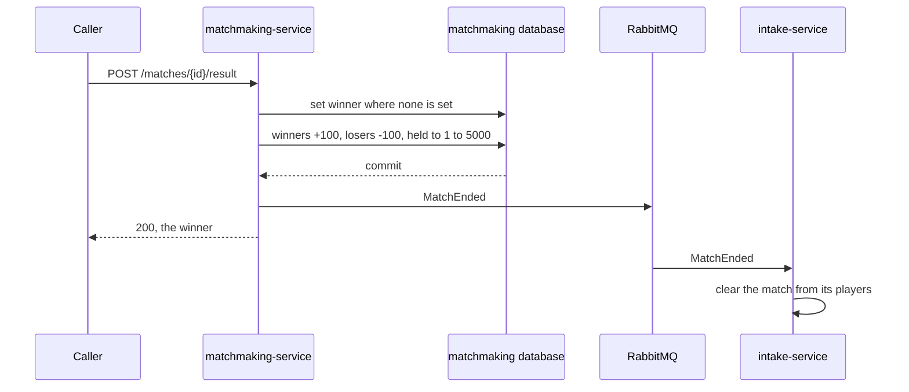
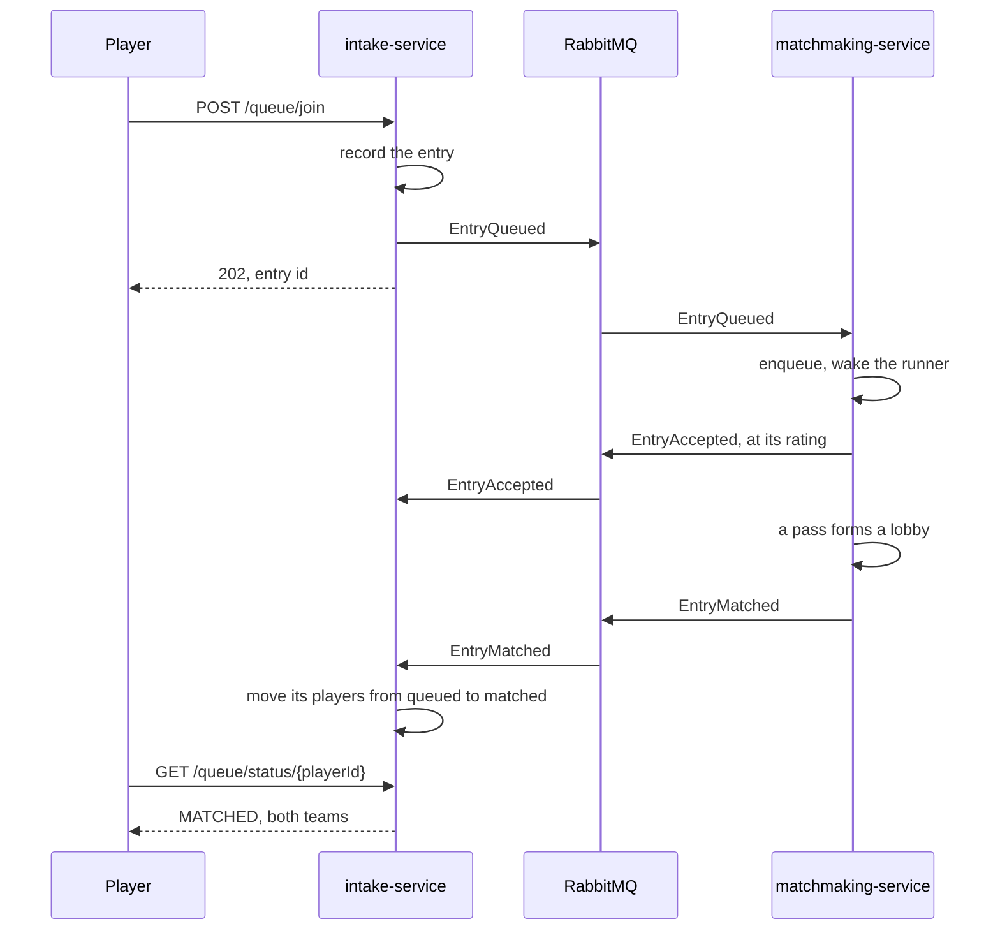
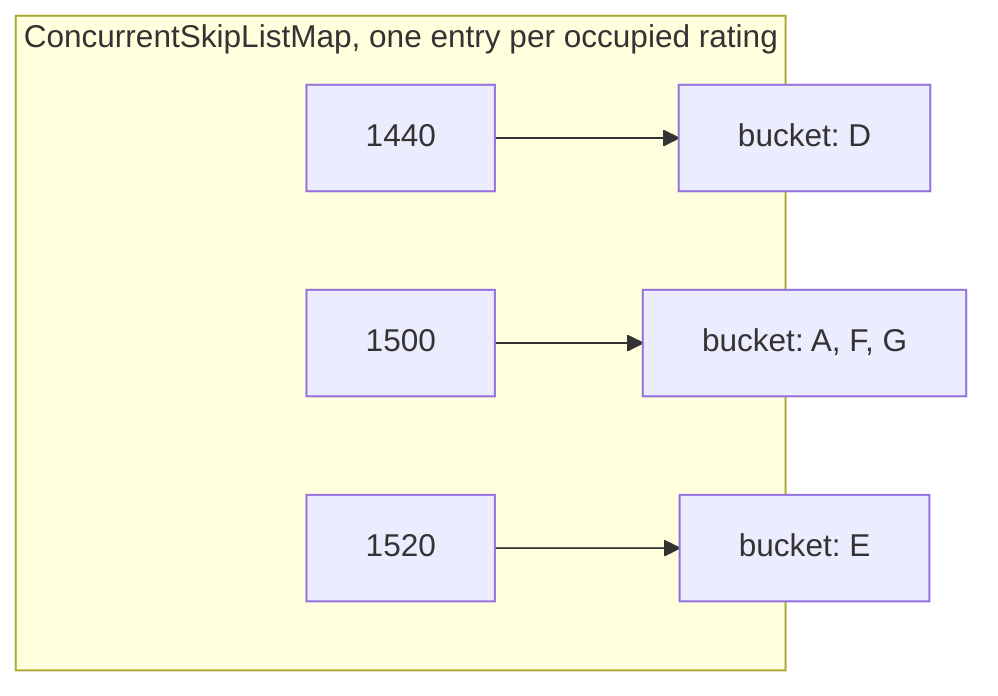

# Extended description

How each part of the system works, close enough to follow without opening a file.

Only built work appears here. New sections go at the top as they land, so the most recent work is the first thing read. Why a decision was taken rather than what it does is in [design-choices.md](design-choices.md).

## Contents

1. [Containers and delivery](#containers-and-delivery)
2. [Persistence and recovery](#persistence-and-recovery)
3. [Two services over a queue](#two-services-over-a-queue)
4. [Parties and teams](#parties-and-teams)
5. [Matching under contention](#matching-under-contention)
6. [Forming a lobby](#forming-a-lobby)
7. [The consent check](#the-consent-check)
8. [The skill index](#the-skill-index)
9. [Fairness and the widening window](#fairness-and-the-widening-window)
10. [Drawing candidates in wait time order](#drawing-candidates-in-wait-time-order)
11. [The domain model](#the-domain-model)
12. [Cost of each operation](#cost-of-each-operation)
13. [Verification](#verification)
14. [The build and the pipeline](#the-build-and-the-pipeline)
15. [Limitations](#limitations)

## Containers and delivery

Each service builds into an image of its own, and one Compose file runs both beside PostgreSQL and RabbitMQ, each in its own container. Every merge to `main` publishes both images.

### The images

Each Dockerfile has two stages. The first, on a full JDK, copies the Gradle wrapper, every module's build file and the sources the service needs, then runs `bootJar`. The second starts from `eclipse-temurin:21-jre`, a Java runtime on Ubuntu, and copies in only the jar, so the image carries no compiler, no Gradle and no source. Both build from the repository root, since intake needs `common`, and matchmaking needs `common` and `matchmaking-core`.

Gradle's download cache sits on a BuildKit cache mount, a folder Docker keeps between builds outside every layer. A source change still reruns the build step, but Gradle finds every library it needs in that folder, so only compiling repeats. The folder never reaches the image.

### Running it with Compose

`docker compose up --build` starts four containers on one private network.

| Container | Image | Reached from the host at |
|---|---|---|
| `postgres` | `postgres:17` | not published |
| `rabbitmq` | `rabbitmq:4-management` | the dashboard, localhost:15672 |
| `intake` | built from `intake-service/Dockerfile` | localhost:8080 |
| `matchmaking` | built from `matchmaking-service/Dockerfile` | localhost:8081 |

Inside the network a container is reached by its service name, and `localhost` means the container itself. So each service is given `SPRING_DATASOURCE_URL` and `SPRING_RABBITMQ_HOST` naming `postgres` and `rabbitmq`, which Spring reads over `application.properties`, and the same jar runs inside a container or out of one.

Postgres keeps its data in the named volume `pgdata`, so stopping or removing the containers keeps every player and match, and `docker compose down -v` is what wipes it. The first start of an empty volume runs `docker/postgres/create-databases.sql`, creating one database per service. Each service then creates its tables through Flyway. Nothing is seeded: players are registered through `POST /players`, as any client would.

The services start only once Postgres and RabbitMQ report healthy. Postgres is checked with `pg_isready` over TCP, because its first start runs a temporary server on a local socket only, which reports ready before the databases exist. RabbitMQ is checked with `rabbitmq-diagnostics ping`. A service that exits with an error is restarted, which covers a dependency failing after startup.

### The end to end check

`e2e-tests` is a module with no dependency on either service. It uses the running system over HTTP, the way any client would, in two phases.

The flow phase registers ten new players and reads each back at 2500, queues a party of two and eight solos, and waits until intake reports every one matched. For each match it checks that intake and matchmaking report the same two teams, reports team A the winner, and gets 409 for a second result. It then waits for every player to read not queued, checks each rating is 2600 or 2400 by side, and checks each history holds the match. Players left queued by an earlier failed run can share a lobby with these, so each player's match is followed as found rather than assumed to be one lobby of ten. The phase ends by writing every player, rating and match it made to `e2e-tests/build/e2e/last-run.properties`.

The after restart phase, `-PafterRestart`, reads that file and checks every player still has the same rating, history and status, every match still exists, and a result for each still gets 409. Run against a wiped database it fails on the first player.

The test only knows two base URLs, `-Pintake` and `-Pmatchmaking`, defaulting to localhost, so it runs unchanged against any deployment. Restarting belongs to the deployment, not the test, so `scripts/e2e-compose.sh` wraps it for Compose: start the stack, wait until both services answer, run the flow, restart intake, matchmaking and Postgres, wait again, run the after restart phase. A normal build skips the module's tests, since it has no running system.

### Publishing the images

After a push to `main`, once every module's build has passed, CI builds both images and pushes them to the GitHub Container Registry as `ghcr.io/amrovv/match3d-intake` and `ghcr.io/amrovv/match3d-matchmaking`. Each is tagged twice: with the full commit SHA, which names exactly the code inside and never moves, and with `latest`, which moves to every new build. CI logs in with the token GitHub creates for each workflow run, so no password is stored anywhere. Pull requests build and test but never publish.

## Persistence and recovery

Each service has a Postgres database of its own, and neither reads the other's. Schemas are Flyway migrations, and Hibernate only checks the entities against them. Everything that must hold when two writers race is one SQL statement, so Postgres settles the race by locking the row rather than Java reading and then writing.

### Matchmaking's database

| Table | Holds |
|---|---|
| `players` | Each player's current rating, overwritten by every result. |
| `matches` | When a match formed, and once it has a result, the winning side and when it ended. Indexed on `formed_at`. |
| `player_matches` | One row per player per match: side, the rating they had and when they queued. Indexed on `player_id`, since the key leads with the match. |

A player exists before they queue. Accounts belong to a system this project stands in for, so `POST /players` creates one at 2500 under the caller's own id, answering 409 if it exists, and running with the `local` profile loads twenty seeded players with ids ending 001 to 020. A join naming anyone with no row is refused as `UNKNOWN_PLAYER`, which also keeps the foreign key from each player's match row satisfied.

A formed match is written as its row and ten player rows in one transaction, before `EntryMatched` is published. History reads cost three queries however long the history: the player's match ids, those matches newest first, and the player rows of all of them at once, grouped into teams in Java.

### Results and ratings

`POST /matches/{id}/result` takes `{"winner": "A"}` or `"B"`, standing in for a game server, and tosses a coin with no body. One transaction sets the winner only if none is set yet, then moves every winner up 100 and every loser down 100, held to 1 to 5000, in two statements Postgres computes itself.



A second result gets 409 and moves nothing, because the first statement finds a winner already set and the rest never runs. Two results racing for one match end the same way, and two results for different matches sharing a player both count, since each adds to the rating Postgres holds at that moment. `MatchEnded` is published only after the commit.

### Intake's database

| Table | Holds |
|---|---|
| `entries` | Each queued entry: when it queued, when intake last sent it, when matchmaking confirmed it, and the rating it was queued at. |
| `players` | Each player's one state: queued under an entry, matched with a match and side, or refused with a reason. A check constraint refuses a row with two. |
| `heartbeat` | One row: when matchmaking's last heartbeat arrived, by intake's clock. |
| `wait_bands` | The latest heartbeat's waits by rating band. |

`IntakeStore` has one transactional method per event. A join claims each member with an update that succeeds only if they are not already queued, in id order so two joins sharing members cannot deadlock, and throws if any claim fails so the whole join rolls back. A join from exactly the members of an existing entry sends that entry again, with its original id and queue time. Queued to matched, and queued to refused, are each one update, so no row is ever briefly in both states. Nothing is held in memory, so any number of intake copies serve any player.

### Failures and how each recovers

| What fails | What happens | What recovers it |
|---|---|---|
| An intake copy, before its join commits | The transaction rolls back. | The player retries. |
| An intake copy, after committing a join and before publishing it | Intake says queued, the engine never heard. | The player's retry, or the sweeper within about 40 seconds. |
| The broker, when matchmaking publishes a lobby | The publish throws. | The match is deleted and its entries go back into the engine with their queue times. |
| Matchmaking, at any point | The engine's memory is gone. | On restart it sends `MatchmakingStarted`, and intake sends every entry it holds again. |
| Matchmaking, between saving a match and publishing it | A match row nobody was told of. | Nothing. The players are requeued and matched again, and the old match is never resulted. |
| Matchmaking, while it stays down | No heartbeats. | Status reads down after 30 seconds. |

`MatchmakingStarted` shares the queue with `EntryMatched`, so a lobby published before a restart reaches intake first and its players are not requeued. RabbitMQ gives each message to one consumer, so one intake copy performs the requeue.

The sweeper runs every ten seconds on every intake copy and sends again any entry sent over 30 seconds ago that matchmaking never confirmed. Counting from the last send rather than the queue time keeps a restart's requeue, whose queue times are old, from being sent twice at once.

### The heartbeat and the wait estimate

Every ten seconds matchmaking sends `MatchmakingAlive`, carrying the last hour's waits grouped by the rating each player had, in bands of 100, as a total and a count of players per band. Intake stamps the arrival with its own clock and replaces its bands. A queued player's status then reads:

```json
{"state": "QUEUED", "entryId": "...", "matchmaking": "UP", "estimatedWaitSeconds": 45}
```

The estimate averages the bands within five of the entry's own, which is roughly plus or minus 500 rating. Shortened to three bands, for an entry queued at 2537, in band 25:

| Band | Ratings | Total wait | Players |
|---|---|---|---|
| 20 | 2000 to 2099 | 100 s | 2 |
| 25 | 2500 to 2599 | 30 s | 1 |
| 30 | 3000 to 3099 | 50 s | 1 |

Bands 20 to 30 are in range, so the estimate is 180 seconds over 4 players, 45. A band of 19 or 31 would be left out. Totals and counts are sent rather than averages because averages of bands cannot be combined without their counts.

With no heartbeat for 30 seconds, or none ever, status reads `"matchmaking": "DOWN"` and gives no estimate. An entry not yet confirmed, or with no recently matched players in range, reads up with the estimate left out.

## Two services over a queue

The engine runs inside `matchmaking-service`. Players reach it through `intake-service`. Each has its own database, and they never call each other: everything between them is an event on RabbitMQ.



### The events

Eight events, defined once in `common` and carried as JSON. One queue runs each way, and each message names its event in the type property.

| Event | Direction | Carries |
|---|---|---|
| `EntryQueued` | intake to matchmaking | entry id, member ids, queue time |
| `EntryLeft` | intake to matchmaking | entry id |
| `EntryAccepted` | matchmaking to intake | entry id, and the rating the engine queued it at |
| `EntryRejected` | matchmaking to intake | entry id, and a reason: duplicate, spread too wide, or unknown player |
| `EntryMatched` | matchmaking to intake | match id, both teams as entry ids |
| `MatchEnded` | matchmaking to intake | match id |
| `MatchmakingStarted` | matchmaking to intake | when it started, so intake sends every entry again |
| `MatchmakingAlive` | matchmaking to intake, every ten seconds | when it was sent, and the last hour's waits by rating band |

Every change to an entry is stated by a message rather than inferred from one not arriving. Only a leave is unconfirmed. No ratings travel toward matchmaking, which owns them and looks each member up. A member list of one is a solo, whose entry id is their own id. Intake creates a fresh entry id for a party on every join. One queue per direction is what keeps a leave from overtaking the join for the same entry.

`EntryMatched` is one message per lobby rather than one per entry, so intake learns of every entry in a lobby or none of them.

### Intake

Three endpoints.

| Endpoint | Answers |
|---|---|
| `POST /queue/join` | 202 and the entry id for one to five distinct member ids. The same members again get their existing entry, sent again. 400 for any other size or a repeated id, 409 if anyone listed is queued in another entry, 503 if the broker is down. |
| `POST /queue/leave` | 202 once the leave is published. 404 if nothing is queued under that entry id, 503 if the broker is down, in which case the entry stays queued. |
| `GET /queue/status/{playerId}` | One of four states: queued with the entry id, whether matchmaking is up, and the estimated wait when known; matched with the match id and both teams; refused with the reason; or not queued. |

`IntakeStore` holds every player's state in intake's database, described under persistence. A double click, or a player joining solo and in a party at once, is refused there: the engine only refuses a repeated entry id, not a repeated person.

A join records the entry, then publishes, and forgets it again if the publish fails, unless it was an entry sent again, which predates the request. A leave publishes, then forgets. Either way intake changes its own records only once matchmaking can know.

`ResultListener` consumes what comes back, and each event is one call on the store. A lobby moves its entries' players to matched. A refusal for a party's spread or an unknown player records the reason against the members and drops the entry. A refusal as a duplicate is a redelivered or resent join intake already holds, and is ignored.

### Matchmaking

`EntryConsumer` reads joins and leaves on one listener thread, so events for an entry are handled in the order intake sent them. A join becomes a `Player` or a `Party`, with ratings read from `RatingStore`, a party's in one query. Anyone with no row is refused as unknown, and building a party checks its spread, refusing a party over the cap. Otherwise the entry goes to `MatchMaker.enqueue`, which refuses a duplicate, `EntryAccepted` goes back with the entry's rating, and the runner is woken. A leave calls `MatchMaker.withdraw`.

`MatchRunner` is one thread. It runs passes until one comes back empty, then waits for the next join or one second, whichever is first. The timeout is there because windows widen with time alone, so a lobby can become possible without anything arriving. While fewer than ten players are queued no pass runs at all, which `SkillIndex.playerCount` answers in constant time.

A lobby holds players, but intake names entries, so `EntryBook` maps each queued player back to their entry. When a lobby forms, the runner records it in `MatchHistory`, translates each team into entry ids, with a party's five members collapsing into its one id, and publishes `EntryMatched`. If the publish fails, the match is deleted, the entries go back into the engine, and the round stops.

| Endpoint | Answers |
|---|---|
| `POST /players` | 201 for a new id at 2500, 409 if it exists, 400 with no id. |
| `GET /players/{id}` | The player's id and current rating, or 404. |
| `GET /matches/{id}` | The match, both teams as player ids and when it formed, or 404. |
| `GET /players/{id}/history` | Every match the player was in, newest first, empty for a player never matched. |
| `POST /matches/{id}/result` | 200 and the winner, from the body or a coin toss. 400 for a winner other than A or B, 404 for an unknown match, 409 if it already has a result. |

The engine and the book are in memory, and a restart rebuilds both from intake's requeue.

### Joins and leaves while passes run

`enqueue` and `withdraw` take the engine's commit lock, so a join or leave never lands halfway through a verify. A withdraw removes the entry from the index, the heap and the cooldown queue. Leaving it cooling would hand the player back as an anchor ten seconds after they left.

The anchor of a running pass is the hard case. It was claimed out of the index and the heap at poll, so a leave arriving mid walk finds it in none of the three structures. `MatchMaker` therefore keeps two sets under its lock: anchors in flight, filled at poll and cleared when the pass settles, and anchors withdrawn, filled only when a leave names an anchor in flight. Every verify checks the second set first, and a withdrawn anchor is dropped: not placed, not cooled, not put back.

A solo who leaves and rejoins while their anchor is still in flight rejoins under the same id. The rejoin clears the mark, and the pass carries on with them as though they had never left.

## Parties and teams

Friends can queue together as a party of two to five. A party always lands in the same lobby, on the same team, or not at all. A lobby is two teams of five.

### Why parties are harder than solos

Not because there is more work. A party is one entry, so every draw, consent check, verify and removal touches it once, the same as a solo, and lobbies form faster with parties than without. Parties add two problems that solo matching never has.

**Filling becomes fitting.** With solos, any ten players who all consent make a lobby. With parties, entries have sizes and cannot be split, so the job is packing them into two teams of exactly five. Three parties of three and a solo all consent and fill ten slots, and still make no lobby, since nothing adds up to five. A walk that places greedily and never backtracks can also get stuck at nine with one slot only a solo can take, and a queue left holding only threes and fours never forms a lobby at all.

**A group needs one rating.** The index, the heap and the consent check all work on one number, so a party has to be squashed into one, and every choice is wrong for someone. The plain mean of a 1000 and a 3500 is 2250, so the 3500 plays opponents far below them and the 1000 plays opponents far above. The highest member instead punishes every ordinary party that happens to have one stronger friend. The mean is shifted halfway toward the strongest, putting that pair at 2875 while an ordinary party barely moves. Whatever the choice, the engine now sees one derived number, so the rule capping the gap between members is checked when the party is built from its members' ratings, in `matchmaking-service`, and trusted after.

### A party is one queue entry

The queue does not hold people, it holds entries. `QueueEntry` is a sealed interface with two implementations: `Player`, one person, and `Party`, several people who queued together. Every entry has one id, one rating, one queue time, a size and a list of members.

| | `Player` | `Party` |
|---|---|---|
| id | the player's | created by intake, fresh per join |
| rating | the player's | derived from the members, below |
| queue time | when they joined | when the party joined, shared by all |
| size | 1 | 2 to 5 |
| members | themselves | the people in it |

Because a party has one rating and one queue time, the index files it in one bucket, the heap orders it in one position, and the consent check tests it as one rating with one radius. None of the three know parties exist. The matcher does not branch on which kind of entry it holds either: it asks every entry for its size when counting slots, and for its members when building the lobby, and a player answers 1 and itself.

That is also what keeps a party whole. The walk offers candidates one entry at a time, so it can take a party or skip it but never take part of one.

### A party's rating

The rating is the mean of the members, pulled halfway toward the strongest:

```
rating = floor(mean + 0.5 * (max - mean))
```

| Party | Mean | Strongest | Rating |
|---|---|---|---|
| 1450, 1500, 1550 | 1500 | 1550 | 1525 |
| 1190, 1210 | 1200 | 1210 | 1205 |
| 1000, 3500 | 2250 | 3500 | 2875 |
| 1000, 1000, 1000, 1000, 3500 | 1500 | 3500 | 2500 |

A tight party barely moves. A strong player carrying weak friends is matched well above the friends' level, so queueing together does not buy easier games.

A party is checked when it is built: two to five members, no two more than 2500 apart, and a stored rating that equals the formula applied to its members. Members cannot change while the party is queued. Adding or losing someone means leaving the queue and queueing again as a new party, with a new id and a fresh queue time. Once queued, the engine sees only the derived rating, so the spread rule is checked at formation and trusted afterwards.

### Filling two teams

`Selection` holds two lists, team A and team B, and the anchor starts on team A. For each candidate the walk offers, it runs the consent check and looks for the first team with room for the whole entry, A before B. If neither has room, the candidate is skipped, and the walk notes whether they would have consented. If one does and consent holds, the candidate is placed on that team. The walk stops when all ten slots are filled or the window runs out.

Shortened to the teams only, with every candidate assumed to pass consent. The anchor is a solo.

| Offered | Team A | Team B | Verdict |
|---|---|---|---|
| anchor | 1 | 0 | seeds team A |
| four stack | 5 | 0 | fits A |
| three stack | 5 | 3 | A is full, fits B |
| three stack | 5 | 3 | 3 + 3 is over five on B, skipped |
| two stack | 5 | 5 | fits B, lobby full |

The skipped three stack is not lost. It stays queued, untouched, for another pass.

Why teams during the walk rather than ten slots split afterwards: three parties of three and a solo fill ten slots, and no combination of them makes five. Filling sides directly means every lobby that forms can actually be played.

The walk never undoes a placement, so it can get stuck. A solo anchor and a four stack fill team A, a second four stack puts team B at four, and only a solo can take the last slot. If the window has none, the pass fails with nine players placed, the anchor cools, and they return later with a wider radius. A pass that fails having skipped a candidate who would have consented is counted as stranded rather than starved, so a lobby lost to party sizes and a window with nobody in range stay distinguishable.

Everything under contention works on entries. The verify checks each placed entry is still queued, the commit removes entries, and the retry budget counts slots, so losing a five stack costs a pass five slots rather than one. `Lobby` is built last, by unpacking each team's entries into their players, so a lobby holds `teamA` and `teamB` as lists of people with the anchor first on team A.

### Testing parties under contention

The race test runs eight workers against one tight cluster and reads the structures after they stop. Half of each round's people are in parties, with sizes cycling two, three, four, five, and each party followed by as many solos. Solos matter: a queue of only four stacks forms nothing, because each side ends up one slot short with nobody small enough to fill it. The order is fixed so any failing round can be run again exactly.

While the population is built, the test records a map from each player's id to the entry they queued in. A solo maps to themselves. That map is what lets a test go from a person placed in a lobby back to the party they came with.

**The split check.** The invariant is that every party with any member placed has all its members placed, in one lobby, on one team. The test walks the lobbies and gives every team of every lobby its own number: lobby 0 has teams 0 and 1, lobby 1 has teams 2 and 3, and so on. For each placed player it looks up their entry and records two things against that entry: the team number they sat on, into a set, and one more player, into a count. Then for every entry that appeared, the count must equal the entry's size, so all its members were placed, and the set must hold exactly one team number, so they all sat together.

Both are needed, because each misses something the other catches. The set is built by walking the lobbies, so a member who was never placed leaves no trace in it. Take a three stack X, Y, Z:

| Placement | Team set | Count | Team check | Count check |
|---|---|---|---|---|
| X, Y on team 3, Z never placed | {3} | 2 | passes | fails, 2 is not 3 |
| X, Y on team 3, Z on team 4 | {3, 4} | 3 | fails | passes |

The count is the only check that compares against how many people the party should have.

**The accounting checks count in the right units.** Lobbies hold people and the index holds entries, so adding the two directly undercounts: a queued three stack is three people but one entry. The check that nobody was lost now counts people on both sides, summing the size of every entry still queued. The check that no placed player is still waiting in the heap looks up the player's entry and asks the heap about that, since a party member's own id was never in the heap and asking about it would always pass.

### Parties under load

`MatchingBenchmark` takes a party share per workload, the fraction of people who queue in a party. Party sizes are uniform over two to five, and members are drawn around a centre with a spread of 100, since friends mostly play at similar levels. A share of zero reproduces the solo population exactly, so earlier numbers still compare. People left queued are counted as people, summing each entry's size, not as entries.

| 20k people, normal spread, 8 workers | lobbies in 100ms |
|---|---|
| solos only | 731 |
| half in parties | 1097 |
| nine in ten in parties | 1208 |

Fifteen repeats each, from `./gradlew :matchmaking-core:benchmark`. Lobbies form faster with parties because the engine's work is per entry, not per person: a draw, a consent check, a verify and a removal each, and a lobby of two five stacks needs two entries where a lobby of solos needs ten.

The cost shows up when the run is long enough to drain the queue.

| 20k people, 3 seconds | lobbies | left queued | starved | stranded |
|---|---|---|---|---|
| solos only | 1995 | 50 | 2962 | 0 |
| half in parties | 2000 | 0 | 5 | 2 |
| nine in ten in parties | 1800 | 2000 | 0 | 27318 |

Three repeats each. With half in parties there are always solos to finish a side. With nine in ten the solos run out, and what remains are parties whose sizes no combination makes into two fives: only threes and fours, say, where a side needs three and two or four and one. Every pass on them seeds a window, walks it, strands and cools, then does it again when the cooldown ends.

The benchmark queue is closed, so nobody joins during a run. A live queue keeps receiving solos, which would finish those sides. The last row is a worst case, not a steady state.

## Matching under contention

Several worker threads run the pass against one shared engine. The expensive part of a pass is selecting candidates, and the cheap part is committing them, so the lock covers the cheap part only.


**The race this closes.** Two workers select overlapping members and both commit them, so one player is placed in two lobbies. Between choosing members and removing them the chosen players are still visible to every other worker, and nothing records that anyone has claimed them. It fails silently: removal returns false for a player already gone and the commit loop ignores it, so both lobbies are internally valid and both are returned.

**The commit is all or nothing.** Ten removals happen only if all ten recruits are still queued. A worker that loses has therefore taken nothing and owes nothing, which is what removes the need for a rollback.

**The anchor is claimed, the recruits are not.** Polling takes the anchor out of the heap and the index, so no other worker can recruit them mid pass. Without it, anchors were the most contested players in the queue: they are the longest waiters, and the merge offers longest waiters first. A cooled anchor is returned to the index, since cooling bars anchoring rather than recruitment, and any abnormal exit returns them to both structures.

**A pass ends four ways**, counted separately: a lobby forms, the anchor had nobody left in range, the anchor was stranded by a party that fit neither team, or the anchor spent its budget losing recruits. The anchor itself cannot be lost to another worker, since the claim takes them out of the index before anyone else can draw them.

**A retry resumes rather than restarts.** `Selection` holds the anchor, the merge cursor and the consent state for one pass. Losing a recruit drops them and refolds consent from those left, then the walk continues from where it stopped. Rebuilding instead would re-seed every bucket in the window, which is what a whole fresh pass costs.

| 20k players, normal spread, 8 workers | lobbies in 100ms |
|---|---|
| rebuilding the walk each retry | 399 |
| resuming it | 988 |

Fifteen repeats each, from `./gradlew :matchmaking-core:benchmark`. What it buys is on the retry path only; both variants match the whole queue given enough time.

**What the structures guarantee and what they do not.** The index and its buckets are skip lists, so a worker may walk a window while another mutates it: iteration never throws and a drawn player may already have left. That is what makes selection outside the lock legal. It is not enough on its own, because a pass spans the index, the heap and the cooldown queue, and per structure safety cannot make a span atomic. The lock does that.

## Forming a lobby

`MatchMaker` works one anchor per call and takes the current instant as a parameter, so it never reads a clock. Its state is the cooldown queue and the commit lock. The diagram below is the uncontended path; what happens when a recruit is taken mid pass is above.


Both outcomes shrink the heap, so a caller can loop until nothing comes back without tracking which anchors it already tried.

Two details that are easy to get wrong. The query window and the consent bounds start as the same two numbers and then diverge, so they are separate variables: the window never moves, the consent bounds narrow with every member placed. And a matched player is pulled from the cooldown queue as well as the heap and index, because cooling bars a player from anchoring but not from being recruited, and leaving them there would hand an already matched player back to the heap on a later drain.

The failure mode, stated rather than left to be found: the pass is greedy and anchored on one player, so it can miss a valid lobby elsewhere in the queue.

### Worked example

Shortened to a four slot lobby to keep the table readable. The real one holds ten.

Anchor A has waited 300 seconds, which buys a radius of 899. Every candidate's own radius comes from their own wait.

| Player | Rating | Waited | Radius | Accepts |
|---|---|---|---|---|
| A, the anchor | 1500 | 300 s | 899 | 601 to 2399 |
| B | 1560 | 120 s | 433 | 1127 to 1993 |
| C | 2300 | 60 s | 250 | 2050 to 2550 |
| D | 1440 | 60 s | 250 | 1190 to 1690 |
| E | 1520 | 15 s | 101 | 1419 to 1621 |

The index is queried for 601 to 2399, so all five are in the window. The merge offers them longest waiting first: A, B, C, D, E.

| Step | Placed span | Narrowest reach | Verdict |
|---|---|---|---|
| Place A | 1500 to 1500 | 601 to 2399 | anchor seeds the set |
| Try B | 1500 to 1560 | 1127 to 1993 | admitted, the reach still covers the span |
| Try C | 1500 to 2300 | 2050 to 1993 | rejected, C's floor of 2050 is above A at 1500 |
| Try D | 1440 to 1560 | 1190 to 1690 | admitted |
| Try E | 1440 to 1560 | 1419 to 1621 | admitted, lobby full |

C is the instructive one. C sits comfortably inside the anchor's window, so a one sided check would have placed them, and C would then have been in a lobby with players 800 rating below anyone C is willing to play.

## The consent check

A lobby is valid when every member accepts every other member. Written directly that is a check over every pair, which suggests backtracking and an expensive search. It collapses to constant time.

Each player accepts a contiguous interval of ratings. A player whose interval reaches both ends of the group's rating span therefore reaches everyone in between. So the pairwise condition is equivalent to a per player one: every member's interval must cover the whole span.

```
ratings ---------------------------------------------------->
              span of placed players
              |<----------------->|
             1440              1560

  A  |<--------------------------------------------->|   601 .. 2399   covers
  B      |<------------------------------->|             1127 .. 1993   covers
  D        |<--------------------->|                     1190 .. 1690   covers
  E           |<------------->|                          1419 .. 1621   covers

  C                          |<------------------>|      2050 .. 2550   misses
                             ^ floor above the span
```

`Overlap` carries four numbers: the span, being the lowest and highest rating placed, and the narrowest reach, being the highest lower bound and the lowest upper bound across members. The pairing is not symmetric. The span takes outer values because it is a union. The reach takes inner ones because a requirement over all members is decided by whichever member reaches least.

Adding a candidate folds all four forward and the set is valid while the reach still covers the span. The record is immutable, so a rejected candidate is discarded and leaves nothing to undo. Adding anyone can only widen the span and narrow the reach, so validity is monotone: a failed set cannot be rescued by adding more players.

## The skill index

`SkillIndex` answers who is queued between two ratings. It is a `ConcurrentSkipListMap` from rating to a bucket of the players at that rating.



One entry per rating rather than per player, so with ratings running 1 to 5000 the index is bounded at 5000 entries however many players queue. Buckets are `ConcurrentSkipListSet` ordered by wait time, so the ordering the merge depends on is a property of the type rather than a consequence of arrivals happening to be chronological.

Insert creates a bucket immediately before adding to it, remove deletes one the moment it empties, and both take a single traversal. The invariant is that a bucket exists exactly while it holds a player, and `ratingCount` is exposed so a test can prove empty buckets are deleted rather than merely emptied.

`entriesInRange` returns a lazy stream of the buckets between two inclusive bounds, each an unmodifiable view. It builds nothing: a mid distribution window can hold thousands of players when a lobby holds ten. Those views are live, and because both levels are skip lists the iteration is weakly consistent: it never throws while another thread mutates the index, and a player drawn from it may already have left. Verifying at commit is what makes that safe, not the draw itself.

## Fairness and the widening window

A player accepts a rating radius around themselves, and it grows the longer they wait. Without it, a player far from the middle of the distribution never matches at all.

`WideningFunction` is pure and static, from a duration to a radius:

```
W(t) = 2500 - (2500 - 50) * e^(-0.00142 * t)
```

| Waited | Radius | Window at rating 1500 |
|---|---|---|
| 0 s | 50 | 1450 to 1550 |
| 15 s | 101 | 1399 to 1601 |
| 60 s | 250 | 1250 to 1750 |
| 300 s | 899 | 601 to 2399 |
| 600 s | 1454 | 46 to 2954 |
| 3600 s | 2485 | the whole domain |

Growth is fastest at the start and flattens. 2500 is an asymptote, never reached, so nothing has to decide what happens at the ceiling. Wait time is converted through milliseconds rather than whole seconds, so the curve is continuous below a second, and the result is floored, so a candidate exactly on the boundary is excluded. A negative duration throws.

`FairnessHeap` orders queued players by entry time, longest waiting first. It is an array backed binary min heap with a map from player id to array index beside it. That map makes removing a player from the middle logarithmic rather than a linear scan, which matters because ten players leave the middle every time a lobby forms.

The invariant the structure rests on: every movement inside the array goes through the swap helper, which updates the map in the same breath. A move that bypasses it leaves the map pointing at the wrong index and removal corrupts the heap silently. Removal moves the last element into the vacated slot and sifts both up and down, since the replacement may be lighter or heavier and only one direction will act.

## Drawing candidates in wait time order

The index yields buckets ordered by rating, each internally ordered by wait time. The matcher needs one sequence ordered by wait time across all of them. `WaitTimeMerge` is that conversion, a k way merge.


Seeding takes one cursor and one head per bucket. From then on the longest waiting head wins, and only the winning bucket advances, so a draw costs a logarithm in the number of buckets rather than a scan. Sorting the window instead would cost a term over every candidate in it, to place nine.

The heap holds bucket indices, not players. The heads list runs parallel to the cursor list, so reordering either would make an index stop naming its own bucket. Ordering lives in a third structure that owns neither. Because the comparator reads heads live, a draw is strictly poll, take, refill, push back, so an index is only ever out of the heap while its head moves. A spent bucket is never pushed back, which makes an index present exactly when its head is a player, and that is what lets the has next check be a size test.

Seeding is the one eager step, touching one player per occupied rating in the window whatever the caller then does. Two tests pin it: seeding a five hundred player bucket pulls one player, and drawing two from a thousand player bucket costs three pulls.

### Nothing is materialised

The index and the merge together are one lazy pipeline, and this is the point of both.

```
window of ~1800 ratings          thousands of queued players
        |
        |  entriesInRange, a stream of live bucket views
        v
  a few hundred bucket references, one head player each     <- the only eager step
        |
        |  MergeIterator, poll, take, refill, push back
        v
  one player, on demand                                     <- repeated ~10 times
```

An anchor five minutes into the queue accepts a radius of 899, so the window spans roughly 1800 ratings and can hold thousands of players. A lobby holds ten. A list would build all of them to hand back ten.

Instead the index hands back buckets rather than players, which costs one reference each and looks inside none of them, and the unmodifiable wrapper is a constant time view rather than a copy. The merge then unpacks those buckets one player at a time. The ordered sequence the matcher walks exists nowhere in memory: it is produced on demand, and a caller taking ten pays for ten draws.

An iterator does the producing because merging is inherently a pull, and it is wrapped as a sequential stream so the caller gets something composable instead. Sequential deliberately, since parallel would destroy the ordering.

Two hazards come with it, neither expressible in the type system: the stream is single use, and it draws from live views, so an entry drawn may already have left. The second is why the commit verifies. Both are documented and both have tests.

## The domain model

Immutable records throughout.

`QueueEntry` is what the queue holds, either a `Player` or a `Party`, described above. It carries the comparator the system orders by, longest waiting first, breaking ties on id so ordering is total and tests are deterministic.

`Player` carries an id, a rating, and the instant they queued. Equality and hash code consider the id alone, so a player reconstructed elsewhere with a slightly different timestamp is still the same player to every structure holding them. `Party` does the same with its own id.

`Lobby` is two teams of five players, each copied and unmodifiable, with the anchor first on team A. `members()` returns both teams, team A first. Sizes are deliberately unvalidated: the matcher is the only thing that builds one and only builds full ones, so a check would test the caller.

`Overlap` is the consent check above.

## Cost of each operation

Five counts, kept apart. `n_r` is the number of occupied ratings, bounded at 5000. `n_b` is the number of players in one bucket. `b` is the number of buckets in a query window. `n_p` is the number of queued players, which appears in the heap costs only and never in an index query. `n_c` is the number of anchors cooling.

| Operation | Cost |
|---|---|
| `SkillIndex.insert`, `SkillIndex.remove` | O(log n_r + log n_b) |
| `SkillIndex.contains`, `playerCount` | O(1) |
| `SkillIndex.entriesInRange`, seeding the merge | O(log n_r + b) |
| `WaitTimeMerge`, per player drawn | O(log b) |
| `FairnessHeap.insert`, `poll`, `remove` | O(log n_p) |
| `FairnessHeap.peek`, `contains`, `size` | O(1) |
| `WideningFunction.ratingRadius` | O(1) |
| `Overlap`, per candidate tested | O(1) |
| `SkillIndex.contains`, verifying one recruit | O(1) |
| Seeding a `Selection`, once per pass | O(log n_r + b) |
| Resuming one after a lost recruit | O(1) per placement refolded, no re-seed |
| `MatchMaker.enqueue` | O(log n_r + log n_b + log n_p) |
| `MatchMaker.withdraw` | O(log n_r + log n_b + log n_p + n_c) |

Derived from the structures, not measured. Every measured figure in this repository comes from `./gradlew :matchmaking-core:benchmark`, so anyone cloning it can reproduce them.

## Verification

207 tests over the eleven core classes, plus a benchmark that reports rather than asserts. The services add 60 tests in `intake-service`, 49 in `matchmaking-service` and 11 in `common`. Both services test against a real Postgres started through Testcontainers, with the real migrations, one container shared by every test class, and without a broker, by publishing through an interface a test replaces. Each test runs in a transaction rolled back at its end, and the tests that must commit, the races, empty the tables when done. One more test in `common`, tagged `broker`, sends each event through a live RabbitMQ and back, and runs only on demand with `./gradlew :common:brokerTest`. Tests were checked by injecting the bug each exists to catch and confirming the suite goes red, one mutation at a time, reverted after each. Every guard in `Party` was mutated this way, and the party split check was confirmed by shuffling the ten players of each lobby before cutting them into teams, which it alone caught.

One known gap. `formLobby` reads the selection's members afresh on every retry, because they are a snapshot of the two teams and go stale after a drop. Removing that re-read survives the suite, since reaching a retry needs another worker to take a member mid pass and no test can arrange that on demand. The effect would be wasted retries rather than a wrong lobby.

Two results are worth more than the count. Dropping the id tiebreak was caught by the heap's tie test and not by the merge's, because without it the order of equal elements is unspecified rather than wrong, so that test passes or fails by luck. And swapping the buckets back to a type that preserves insertion order is caught by exactly one test, the one that inserts out of chronological order, because every other ordering test inserts in order and passes either way.

The concurrent tests read the structures after the workers have stopped rather than trying to catch an interleaving, since the evidence a race leaves is permanent while its timing is not. One exists to keep the harness honest rather than the engine: it fails if a run produces no retries at all, which is what tells a working fix apart from one that was never contended.

Leaves are raced the same way. Four runner threads form lobbies while a fifth withdraws half the queue and rejoins half of those, over 300 rounds. Afterwards, no player whose withdraw succeeded may sit in any lobby, and every rejoined player must be in exactly one place, a lobby or the queue. Removing the check for a withdrawn anchor fails it, and so does removing the rejoin's cancellation. Around 290 leaves per run reach an anchor mid pass, so the case the check guards is exercised rather than assumed.

The database races are tested on separate connections, outside the test transaction, over many rounds: eight joins sharing one player admit exactly one and the losers leave no entry behind; two parties listing shared members in opposite orders never deadlock; eight results racing for one match move ratings once; one player in two matches ended together gains both wins; eight registrations of one id create it once. Each was checked against the bug it exists for. Dropping the claim's `entry_id is null` guard queues a player twice, claiming members unsorted deadlocks, dropping the result's `winner is null` guard double counts, and replacing the rating statement with a read and a write in Java loses a win. Returning a failed lobby to the engine was checked by skipping the return, and stopping the round after a failed publish by letting the round continue, which the test makes fail by letting only the first publish fail rather than letting the round spin.

Both services were also run together against a real Postgres and RabbitMQ: a party and eight solos matched into one lobby that both services report alike, a result moving the five winners to 2600 and the losers to 2400, the estimate appearing once a match existed, an unknown player refused, status reading down within 30 seconds of stopping matchmaking, and a waiting entry requeued when it restarted.

The whole system in containers is checked by the end to end test, run with `scripts/e2e-compose.sh` from an empty database: both phases pass, and the after restart phase was confirmed to fail once the volume was wiped between them.

## The build and the pipeline

One Gradle build over five modules. `matchmaking-core` depends on nothing. `common` holds the types both services share. Both services depend on `common`, and `matchmaking-service` also on `matchmaking-core`. Nothing depends on a service, so the engine compiles and tests with no framework on the classpath. `e2e-tests` depends on no other module and speaks to the services over HTTP only.

`.gitattributes` checks `gradlew` and every shell script out with Unix line endings on every machine. A Windows checkout otherwise converts them, and Linux, inside a container or in Git Bash, then cannot run them.

Java 21 is pinned through the Gradle toolchain rather than assumed from the path, so the build resolves the same compiler locally and in CI. JUnit 5 is wired once at the root and inherited.

Both services run on Spring Boot, with Spring AMQP for RabbitMQ and Spring Data JPA over Postgres, and Flyway migrating each database at startup. `common` holds the events and the one Jackson mapper both services read and write them through. The heartbeat and the sweeper are Spring scheduled tasks.

CI runs on every push to `main` and every pull request, as one job per module, each running `./gradlew :<module>:build`, so each module reports its own check and one failure does not cancel the others. The service jobs start their Postgres through Docker on the runner. On a push to `main`, a further job per service builds its image and publishes it once all four module jobs pass, described under containers. Branch protection makes a green pull request the only way `main` moves, and the pull request template requires a trade offs section, so what was rejected is recorded at the time rather than reconstructed later.

## Limitations

The README lists the ones that matter most. This is all of them, by the part of the system they belong to.

| Part | Limitation |
|---|---|
| Matching | The pass is greedy and anchored on the longest waiter, so it can miss a valid lobby that exists elsewhere in the queue. |
| Matching | A lobby forms only when its entries fill two teams of exactly five, and a party is never split. Once solos run out, parties whose sizes cannot combine into fives wait until someone smaller joins. In a closed benchmark queue of 20k people, nine in ten of them in parties, 2000 were never matched. |
| Matching | The widening curve's constants and the ten second cooldown are chosen, not derived. No player behaviour data exists to derive them from. |
| Scaling | Every commit serialises through one lock, so the engine scales by making passes cheap rather than by running more of them. Sharding the queue by rating band is the next step and is not built. |
| Scaling | Matching runs in one process. Several threads share one engine, but nothing coordinates two engines, so scaling matchmaking out is a design question rather than a configuration one. Intake already runs as any number of copies. |
| Measurement | The benchmark measures throughput on a synthetic population. No latency or queue time figure is measured. |
| Ratings | Ratings move a flat 100 per result, regardless of how strong the opponents were. An Elo style update is future work. |
| Ratings | History does not show the rating a player had going into each match, although `player_matches` stores it. |
| Recovery | If matchmaking dies between saving a match and publishing it, the players are requeued and matched again, and the saved match stays in their history, never resulted. |
| Recovery | A lost `MatchEnded` leaves its players reading as matched until they queue again, with their ratings already moved. |
| Recovery | A leave arriving while intake requeues after a matchmaking restart can leave an entry in the engine that intake has forgotten. |
| Recovery | Matchmaking is reported down only after 30 seconds without a heartbeat, and a lost join is found by the sweeper only after about 40 seconds. |
| Recovery | A message a service cannot handle is logged and dropped. There is no dead letter queue to keep it for inspection. |
| Queue | A party refused for an unknown member is not told which member it was. |
| Queue | Joining a party while already queued is refused rather than moving the player into it. |
| Queue | Wait estimates count matched players only, since leavers are never recorded. They use rating bands of 100, so plus or minus 500 is approximate at its edges, and a party is estimated from solos and parties alike, which likely flatters it. |
| Deployment | The system runs in Compose on one machine. Kubernetes and a cloud deployment are not built yet. |
| Deployment | The Postgres password is in the repository, in `application.properties` and the Compose file. It suits a local setup only. |
| Deployment | The runtime image keeps a shell for debugging, at the cost of size and of tools an attacker could use. A distroless Java image is the next step. |
| Deployment | The services have no health endpoint, so Compose starts them without checking they are ready, and the end to end script decides they are up by asking each a question it can answer. |
| Deployment | Each image build in CI downloads every library again, since nothing is cached between runs. |
