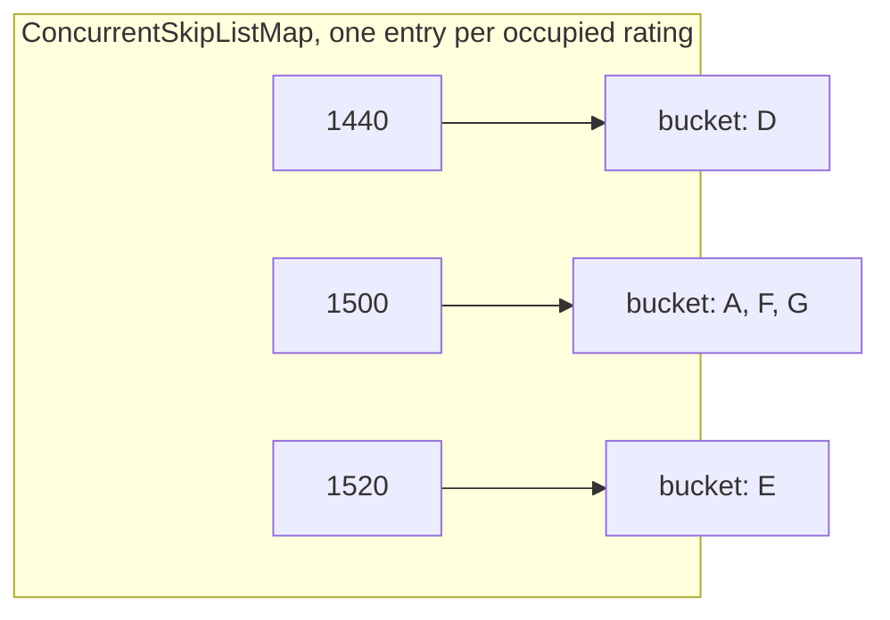

# Extended description

How each part of the system works, close enough to follow without opening a file.

Only built work appears here. New sections go at the top as they land, so the most recent work is the first thing read. Why a decision was taken rather than what it does is in [design-choices.md](design-choices.md).

## Contents

1. [Forming a lobby](#forming-a-lobby)
2. [The consent check](#the-consent-check)
3. [The skill index](#the-skill-index)
4. [Fairness and the widening window](#fairness-and-the-widening-window)
5. [Drawing candidates in wait time order](#drawing-candidates-in-wait-time-order)
6. [The domain model](#the-domain-model)
7. [Cost of each operation](#cost-of-each-operation)
8. [Verification](#verification)
9. [The build and the pipeline](#the-build-and-the-pipeline)

## Forming a lobby

`MatchMaker` makes one attempt per call and takes the current instant as a parameter, so it never reads a clock. Its only state is the queue of anchors sitting out a cooldown.


Both outcomes shrink the heap, so a caller can loop until nothing comes back without tracking which anchors it already tried.

Two details that are easy to get wrong. The query window and the consent bounds start as the same two numbers and then diverge, so they are separate variables: the window never moves, the consent bounds narrow with every member seated. And a matched player is pulled from the cooldown queue as well as the heap and index, because cooling bars a player from anchoring but not from being recruited, and leaving them there would hand an already matched player back to the heap on a later drain.

The failure mode, stated rather than left to be found: the pass is greedy and anchored on one player, so it can miss a valid lobby elsewhere in the queue.

### Worked example

Shortened to a four seat lobby to keep the table readable. The real one seats ten.

Anchor A has waited 300 seconds, which buys a radius of 899. Every candidate's own radius comes from their own wait.

| Player | Rating | Waited | Radius | Accepts |
|---|---|---|---|---|
| A, the anchor | 1500 | 300 s | 899 | 601 to 2399 |
| B | 1560 | 120 s | 433 | 1127 to 1993 |
| C | 2300 | 60 s | 250 | 2050 to 2550 |
| D | 1440 | 60 s | 250 | 1190 to 1690 |
| E | 1520 | 15 s | 101 | 1419 to 1621 |

The index is queried for 601 to 2399, so all five are in the window. The merge offers them longest waiting first: A, B, C, D, E.

| Step | Seated span | Narrowest reach | Verdict |
|---|---|---|---|
| Seat A | 1500 to 1500 | 601 to 2399 | anchor seeds the set |
| Try B | 1500 to 1560 | 1127 to 1993 | admitted, the reach still covers the span |
| Try C | 1500 to 2300 | 2050 to 1993 | rejected, C's floor of 2050 is above A at 1500 |
| Try D | 1440 to 1560 | 1190 to 1690 | admitted |
| Try E | 1440 to 1560 | 1419 to 1621 | admitted, lobby full |

C is the instructive one. C sits comfortably inside the anchor's window, so a one sided check would have seated them, and C would then have been in a lobby with players 800 rating below anyone C is willing to play.

## The consent check

A lobby is valid when every member accepts every other member. Written directly that is a check over every pair, which suggests backtracking and an expensive search. It collapses to constant time.

Each player accepts a contiguous interval of ratings. A player whose interval reaches both ends of the group's rating span therefore reaches everyone in between. So the pairwise condition is equivalent to a per player one: every member's interval must cover the whole span.

```
ratings ---------------------------------------------------->
              span of seated players
              |<----------------->|
             1440              1560

  A  |<--------------------------------------------->|   601 .. 2399   covers
  B      |<------------------------------->|             1127 .. 1993   covers
  D        |<--------------------->|                     1190 .. 1690   covers
  E           |<------------->|                          1419 .. 1621   covers

  C                          |<------------------>|      2050 .. 2550   misses
                             ^ floor above the span
```

`Overlap` carries four numbers: the span, being the lowest and highest rating seated, and the narrowest reach, being the highest lower bound and the lowest upper bound across members. The pairing is not symmetric. The span takes outer values because it is a union. The reach takes inner ones because a requirement over all members is decided by whichever member reaches least.

Adding a candidate folds all four forward and the set is valid while the reach still covers the span. The record is immutable, so a rejected candidate is discarded and leaves nothing to undo. Adding anyone can only widen the span and narrow the reach, so validity is monotone: a failed set cannot be rescued by adding more players.

## The skill index

`SkillIndex` answers who is queued between two ratings. It is a `ConcurrentSkipListMap` from rating to a bucket of the players at that rating.



One entry per rating rather than per player, so with ratings running 1 to 5000 the index is bounded at 5000 entries however many players queue. Buckets are `ConcurrentSkipListSet` ordered by wait time, so the ordering the merge depends on is a property of the type rather than a consequence of arrivals happening to be chronological.

Insert creates a bucket immediately before adding to it, remove deletes one the moment it empties, and both take a single traversal. The invariant is that a bucket exists exactly while it holds a player, and `ratingCount` is exposed so a test can prove empty buckets are deleted rather than merely emptied.

`playersInRange` returns a lazy stream of the buckets between two inclusive bounds, each an unmodifiable view. It builds nothing: a mid distribution window can hold thousands of players when a lobby seats ten. Those views are live, and because both levels are skip lists the iteration is weakly consistent: it never throws while another thread mutates the index, and a player drawn from it may already have left. Verifying at commit is what makes that safe, not the draw itself.

## Fairness and the widening window

A player accepts a rating radius around themselves, and it grows the longer they wait. Without it, a player far from the middle of the distribution never matches at all.

`WideningFunction` is pure and static, from a duration to a radius:

```
W(t) = 2500 - (2500 - 50) * e^(-0.00142 * t)
```

| Waited | Radius | Window at rating 1500 |
|---|---|---|
| 0 s | 50 | 1450 to 1550 |
| 15 s | 101 | 1399 to 1601 |
| 60 s | 250 | 1250 to 1750 |
| 300 s | 899 | 601 to 2399 |
| 600 s | 1454 | 46 to 2954 |
| 3600 s | 2485 | the whole domain |

Growth is fastest at the start and flattens. 2500 is an asymptote, never reached, so nothing has to decide what happens at the ceiling. Wait time is converted through milliseconds rather than whole seconds, so the curve is continuous below a second, and the result is floored, so a candidate exactly on the boundary is excluded. A negative duration throws.

`FairnessHeap` orders queued players by entry time, longest waiting first. It is an array backed binary min heap with a map from player id to array index beside it. That map makes removing a player from the middle logarithmic rather than a linear scan, which matters because ten players leave the middle every time a lobby forms.

The invariant the structure rests on: every movement inside the array goes through the swap helper, which updates the map in the same breath. A move that bypasses it leaves the map pointing at the wrong index and removal corrupts the heap silently. Removal moves the last element into the vacated slot and sifts both up and down, since the replacement may be lighter or heavier and only one direction will act.

## Drawing candidates in wait time order

The index yields buckets ordered by rating, each internally ordered by wait time. The matcher needs one sequence ordered by wait time across all of them. `WaitTimeMerge` is that conversion, a k way merge.


Seeding takes one cursor and one head per bucket. From then on the longest waiting head wins, and only the winning bucket advances, so a draw costs a logarithm in the number of buckets rather than a scan. Sorting the window instead would cost a term over every candidate in it, to seat nine.

The heap holds bucket indices, not players. The heads list runs parallel to the cursor list, so reordering either would make an index stop naming its own bucket. Ordering lives in a third structure that owns neither. Because the comparator reads heads live, a draw is strictly poll, take, refill, push back, so an index is only ever out of the heap while its head moves. A spent bucket is never pushed back, which makes an index present exactly when its head is a player, and that is what lets the has next check be a size test.

Seeding is the one eager step, touching one player per occupied rating in the window whatever the caller then does. Two tests pin it: seeding a five hundred player bucket pulls one player, and drawing two from a thousand player bucket costs three pulls.

### Nothing is materialised

The index and the merge together are one lazy pipeline, and this is the point of both.

```
window of ~1800 ratings          thousands of queued players
        |
        |  playersInRange, a stream of live bucket views
        v
  a few hundred bucket references, one head player each     <- the only eager step
        |
        |  MergeIterator, poll, take, refill, push back
        v
  one player, on demand                                     <- repeated ~10 times
```

An anchor five minutes into the queue accepts a radius of 899, so the window spans roughly 1800 ratings and can hold thousands of players. A lobby seats ten. A list would build all of them to hand back ten.

Instead the index hands back buckets rather than players, which costs one reference each and looks inside none of them, and the unmodifiable wrapper is a constant time view rather than a copy. The merge then unpacks those buckets one player at a time. The ordered sequence the matcher walks exists nowhere in memory: it is produced on demand, and a caller taking ten pays for ten draws.

An iterator does the producing because merging is inherently a pull, and it is wrapped as a sequential stream so the caller gets something composable instead. Sequential deliberately, since parallel would destroy the ordering.

Two hazards come with it, neither expressible in the type system: the stream is single use, and it draws from live views, so the index must not be mutated mid draw. Both are documented and both have tests.

## The domain model

Three immutable records.

`Player` carries an id, a rating, and the instant they queued. Equality and hash code consider the id alone, so a player reconstructed elsewhere with a slightly different timestamp is still the same player to every structure holding them. It also carries the comparator the system orders by, longest waiting first, breaking ties on id so ordering is total and tests are deterministic.

`Lobby` is the members in the order the matcher chose them, which puts the anchor first. The list is copied and unmodifiable. Size is deliberately unvalidated: the matcher is the only thing that builds one and only builds full ones, so a check would test the caller.

`Overlap` is the consent check above.

## Cost of each operation

Four counts, kept apart. `n_r` is the number of occupied ratings, bounded at 5000. `n_b` is the number of players in one bucket. `b` is the number of buckets in a query window. `n_p` is the number of queued players, which appears in the heap costs only and never in an index query.

| Operation | Cost |
|---|---|
| `SkillIndex.insert`, `SkillIndex.remove` | O(log n_r + log n_b) |
| `SkillIndex.contains` | O(1) |
| `SkillIndex.playersInRange`, seeding the merge | O(log n_r + b) |
| `WaitTimeMerge`, per player drawn | O(log b) |
| `FairnessHeap.insert`, `poll`, `remove` | O(log n_p) |
| `FairnessHeap.peek`, `contains`, `size` | O(1) |
| `WideningFunction.ratingRadius` | O(1) |
| `Overlap`, per candidate tested | O(1) |

Derived from the structures, not measured. No throughput or latency figure appears anywhere in this repository, because no benchmark exists that someone cloning it could reproduce.

## Verification

118 tests over the eight core classes. Every one was checked by injecting the bug it exists to catch and confirming the suite goes red: thirteen mutations across four classes, applied one at a time and reverted. All thirteen were caught.

Two results are worth more than the count. Dropping the id tiebreak was caught by the heap's tie test and not by the merge's, because without it the order of equal elements is unspecified rather than wrong, so that test passes or fails by luck. And the cooldown defect above is caught by exactly one test, having been found by reasoning rather than by anything failing. Both matter when this code becomes concurrent.

## The build and the pipeline

One Gradle build over four modules. `matchmaking-core` depends on nothing. `common` holds the types both services share. Both services depend on `common`, and `matchmaking-service` also on `matchmaking-core`. Nothing depends on a service, so the engine compiles and tests with no framework on the classpath.

Java 21 is pinned through the Gradle toolchain rather than assumed from the path, so the build resolves the same compiler locally and in CI. JUnit 5 is wired once at the root and inherited.

CI runs `./gradlew build test` on every push to `main` and every pull request. Branch protection makes a green pull request the only way `main` moves, and the pull request template requires a trade offs section, so what was rejected is recorded at the time rather than reconstructed later.
